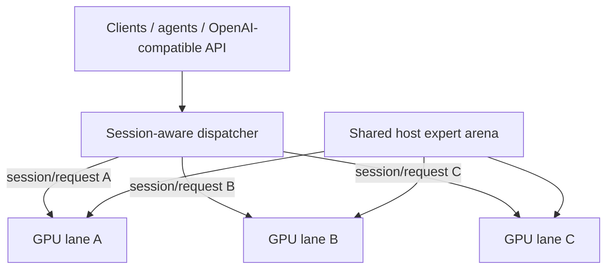

# Qwen3.8-Flash-Next / Strata GPU-per-Lane 並列サービングレシピ

[English](README.md) | [한국어](README.ko.md) | [简体中文](README.zh-CN.md) | **日本語**

このリポジトリは、**GPU 1枚につき独立した Strata generation lane を1つ**動かし、複数 lane プロセスが大きな host-RAM expert arena を**物理的に1組だけ共有**する実用的なサービング構成をまとめたものです。

**Upstream:** Strata は [Niko1221](https://github.com/Niko1221) が作成・保守する inference engine で、upstream は [`Niko1221/Strata`](https://github.com/Niko1221/Strata) です。このリポジトリは、その上に追加した multi-lane serving と shared-arena 拡張を記録します。

## 現在の状態

- 実装 fork: [`rhgo1749/Strata-Lanes`](https://github.com/rhgo1749/Strata-Lanes)
- **現在の運用 Strata-Lanes pin:** [`48a51d3`](https://github.com/rhgo1749/Strata-Lanes/commit/48a51d33a8436c9504dd24c180aa4fc7adcfdd66)
- エンジン基準: Strata **0.1.38**（upstream `99f3dbd`）；同期記録: [`docs/strata-0.1.38-promotion-20261003.md`](docs/strata-0.1.38-promotion-20261003.md)
- 現行 production text engine SHA256: `a1793a6e3f65dc271f8fa1af6148b374aac7398e431b3f94e40010846049a3bd`
- 参照ホストの現行 production quant: **Qwen3.8-Flash-Next GSQ-RCO IQ3_S**
- production lanes: **RTX 5070 Ti ×3 のみ**。RTX 5060 Ti は serving pool から除外
- lane-local conversation parking: **lane ごとに 4096 MiB / 4 slots / MemAvailable floor 8192 MiB**
`main` は現在の運用レシピを追跡します。保持する実測結果とバージョン境界は [`RESULTS.md`](RESULTS.md) にまとめます。さらに古いスナップショットは moving `main` に重複保持せず、Git history と名前付き branch から確認できます。

## 基本アーキテクチャ

**アクティブな1リクエストは1つの GPU lane が処理し、複数リクエストは別々の GPU で同時実行します。大きな expert weight は各プロセスに複製せず、system RAM 上で物理共有します。**



CUDA state、GPU hot-expert cache、GPU-resident KV、host-KV/session state、speculative/MTP state、generation loop は lane-local です。通常の production path には必須の token-by-token cross-GPU 同期がなく、NVLink も必須ではありません。

## Session-aware scheduler

初期 multi-lane supervisor は request-level の free-lane/round-robin でした。独立リクエストの throughput 試験には十分ですが、KV/prompt cache は lane-local なので、長い会話の次ターンが別 GPU に移ると full または大規模な prompt re-prefill が発生し得ます。

現在の `main` は **厳格な session affinity + balanced-additive の新規 session 配置**を使い、優先順位を明示しています。

1. まず、healthy で hard capability 条件（例: vision）を満たす lane だけを候補にします。
2. 既知 session の場合は、その session が記憶している lane を使います。その lane が busy なら、**別 GPU へ spill せず、その lane の後ろで待ちます。**
3. 完全に新しい session は busy lane に割り込みません。すべての候補が busy なら、request/stream が完全に終了して lane が release されるまで待ちます。
4. 利用可能な idle lane の中では、まず **記憶済み affinity session 数が最も少ない lane**を優先し、長期 cache state が1つの lane を恒常的な attractor にしないようにします。
5. session 数が同じ候補では、**推定 new-prefill bytes + 直前に完了した request の retained bytes** の合計を最小化します。これは routing-state proxy であり、engine-truth の compute cost を意味しません。
6. live-state recency と rotating candidate order は同率時の tie-breaker として残します。`safe-affinity-live-state-v1` は明示的な rollback policy として維持します。

待機中の新しい session は **compatible FIFO ticket** で並びます。先に待っていてその lane を利用できる request が、新しく解放された lane を優先して取得します。一方、vision のように capability 制約のある request は、自分が利用できない別 lane まで塞ぎません。既知 session の continuation が自分の lane を待っている間はその lane を予約するため、`notify_all()` の wake-up race で新しい session が cache-rich lane を横取りできません。実際の空 live state は affinity key の有無ではなく `live_request_bytes == 0` で判定します。

この方針は **GPU 番号、GPU モデル、PCIe 幅をハードコードしません。** `busy` の寿命は request/stream 単位、affinity の寿命は session 単位です。1つの engine に複数 session key を記憶できるため、途中で別リクエストがその engine を使っても、古い session は同じ engine に戻り、Strata の per-engine prompt-cache checkpoint を再利用できます。

production smoke では A → B → C → D → A を検証しました。A/B/C が空き lane を埋め、D は live state が最小の lane を選択し、最後の A は元の lane に戻りました。さらに overload smoke では3つの lane をすべて使用中に4リクエストを追加し、`peak_queue_depth=4` を観測しました。7リクエストすべて成功した後、`queue_depth=0`、全 lane idle に正常復帰しました。

この scheduler は **現行の lane-local KV アーキテクチャを安全に運用するための serving hardening** であり、最終的な最適 scheduler と主張するものではありません。cache-aware global scheduling、migration/transfer cost、overload queueing、より明示的な cost model は roadmap 項目です。

### Lane-local conversation parking

現在の production は、各 independent lane で upstream Strata の native conversation parking を使います。Lanes 独自の snapshot 形式を追加するのではなく、supervisor が same-lane affinity を維持し、通常の Strata engine に `--conversation-cache-mib 4096`、`--conversation-cache-slots 4`、`--conversation-cache-min-free-mib 8192` を渡します。`slots` は GPU 数や request queue 長ではなく、**1 lane が RAM に park できる conversation 数**です。実容量は 4 GiB の byte budget にも制限されます。eviction 後も affinity は保持され、同じ lane で prompt recompute に安全にフォールバックします。

reference host の非公開 deployment wrapper を経由して標準 Lanes supervisor に到達する matched A/B では（この wrapper は本リポジトリに含まれません）、6 stable mixed sessions の cold turn 1 は約 0.1% 差で、parking により returning turn 2/3 の wall time が **35.7% / 32.2%**、mean E2E が **28.5% / 25.7%** 改善し、aggregate completion throughput は **55.4% / 59.1%** 増加しました。Hermes `eval` 検証では約 25K-token prompt の多くの再訪で **25.1K–25.6K tokens** を再利用できました。詳細は [`docs/lane-local-conversation-parking-20261003.md`](docs/lane-local-conversation-parking-20261003.md) を参照してください。

## 参照ホスト

```text
CPU                 Ryzen 9 9950X3D, 16C/32T
RAM                 128 GB DDR5
GPU lanes           RTX 5070 Ti 16 GB ×3
PCIe                x8 / x4 / x8
contexts            262144 / 262144 / 262144
resident KV         32768 / 32768 / 32768
VRAM reserve MiB    1200 / 1200 / 1200
physical CPU cores  5 / 6 / 5
production vision   選択した1 lane
current quant       IQ3_S
```

これらは**参照ホストでの実測値であり、汎用デフォルトではありません。**

### mixed vision/text lane の VRAM reserve 注意点

vision を有効にした base config から text-only lane を派生させる場合、`--vision` と encoder 設定を外すのは正しい一方、VRAM の安全余裕まで一緒に失わないようにする必要があります。参照環境の RTX 5070 Ti 16 GB / IQ3_S / 262K context / resident-KV 32768 では、non-vision lane が 700 MiB reserve に戻るとロード後の空き VRAM が約 **93 MiB**しか残らず、実際に `verify: instantiate: out of memory` が発生しました。

現在の production は `--lane-vram-reserve-mibs 1200,1200,1200` を明示します。再測定では GPU0/GPU1/GPU2 の空き VRAM がそれぞれ **593 / 592 / 593 MiB**となり、3 lane の同時 public request はすべて HTTP 200 で完了し、新しい startup 以降の OOM / illegal-memory / engine-stop は 0 件でした。1200 MiB はあくまで**参照ホストの安全値**であり、すべての GPU に対する汎用デフォルトではありません。この問題は vision encoder が text-only GPU の VRAM を消費したためではなく、mixed-capability lane を派生する際に text-only lane から reserve が外れたことで顕在化したものです。

host RAM は概ね次のように見積もれます。

```text
required host RAM ≈ one shared expert arena + every lane's host-KV + OS/runtime headroom
```

## バージョン別 evidence

moving `main` は現在の **0.1.38 software baseline** と 0.1.38 full benchmark campaign を追跡します。0.1.31 Phase 3 lifecycle と 0.1.30 architecture matrix は元バージョンの履歴 evidence として保持し、0.1.38 に再ラベルしません。

参照:

- [`RESULTS.md`](RESULTS.md) — 現在の要約と保持中の benchmark evidence
- [`docs/strata-0.1.38-full-campaign-20261003.md`](docs/strata-0.1.38-full-campaign-20261003.md) — 現行 0.1.38 full benchmark campaign
- [`docs/strata-0.1.38-promotion-20261003.md`](docs/strata-0.1.38-promotion-20261003.md) — 現行 0.1.38 software-sync promotion
- [`docs/USAGE.md`](docs/USAGE.md) — direct Lanes 起動/session ID/parking/status の使用法
- [`docs/lane-local-conversation-parking-20261003.md`](docs/lane-local-conversation-parking-20261003.md) — deployment parking / Hermes eval 検証
- [`docs/strata-0.1.34-promotion-20261002.md`](docs/strata-0.1.34-promotion-20261002.md) — 保持中の 0.1.34 promotion 記録
- [`docs/strata-0.1.31-promotion-20261001.md`](docs/strata-0.1.31-promotion-20261001.md) — 保持中の完全な live/parity evidence
- [`docs/strata-0.1.30-promotion-20261001.md`](docs/strata-0.1.30-promotion-20261001.md) — 保持中の完全な benchmark generation
- [`docs/fork-and-implementation.md`](docs/fork-and-implementation.md) — upstream/fork/recipe の役割境界

## 別の PC へ適用する場合

1. まず各 GPU で single-GPU Strata を正常動作させます。
2. VRAM、negotiated PCIe link、RAM headroom、CPU topology を確認します。
3. lane worker pool が重ならないよう physical CPU core を分割します。
4. 保守的な context/resident-KV から始め、各 lane を単独検証します。
5. multi-lane concurrency、cold/no-reuse 長文、streaming/cancellation、lane recovery、**multi-turn session affinity** を検証します。
6. 参照ホストの tuning 値は portable default ではなく測定値として扱います。

## 関連プロジェクト

- Upstream Strata: [`Niko1221/Strata`](https://github.com/Niko1221/Strata)
- Multi-lane 実装 fork: [`rhgo1749/Strata-Lanes`](https://github.com/rhgo1749/Strata-Lanes)
- ExLlamaV3 companion recipe: [`rhgo1749/qwen3.8-flash-next-exllamav3-3x5070ti-recipe`](https://github.com/rhgo1749/qwen3.8-flash-next-exllamav3-3x5070ti-recipe)

## License

このリポジトリの recipe 文書と helper material は MIT License です。Strata とモデルファイルはそれぞれ元のライセンスに従います。