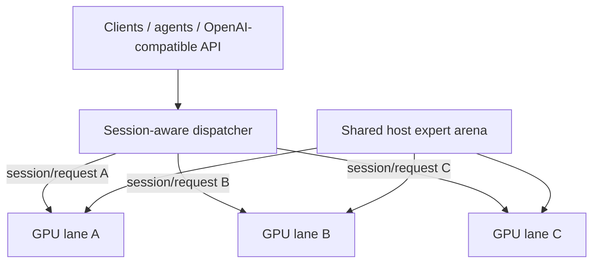

# Qwen3.8-Flash-Next / Strata GPU-per-Lane 並列サービングレシピ

[English](README.md) | [한국어](README.ko.md) | [简体中文](README.zh-CN.md) | **日本語**

このリポジトリは、**GPU 1枚につき独立した Strata generation lane を1つ**動かし、複数 lane プロセスが大きな host-RAM expert arena を**物理的に1組だけ共有**する実用的なサービング構成をまとめたものです。

**Upstream:** Strata は [Niko1221](https://github.com/Niko1221) が作成・保守する inference engine で、upstream は [`Niko1221/Strata`](https://github.com/Niko1221/Strata) です。このリポジトリは、その上に追加した multi-lane serving と shared-arena 拡張を記録します。

## 現在の状態

- 実装 fork: [`rhgo1749/Strata`](https://github.com/rhgo1749/Strata)
- **現在の運用 Strata pin:** [`614b2ae`](https://github.com/rhgo1749/Strata/commit/614b2ae904bbe949144c694388b985fc6a0d20d8)
- エンジン基準: Strata **0.1.27**（upstream `a790805`）
- 参照ホストの現行 production quant: **Qwen3.8-Flash-Next GSQ-RCO IQ3_S**
- 凍結済み paper-v1 recipe snapshot: [`f54597a`](https://github.com/rhgo1749/qwen3.8-flash-next-strata-gpu-per-lane-recipe/commit/f54597a071e56bb0412685c46c4d604d50e26e45), branch `paper-v1`
- 凍結済み paper-v1 Strata 実装 pin: [`6cf101d`](https://github.com/rhgo1749/Strata/commit/6cf101d5b98523cbaefc34a199faa5657c5c2719)

`main` は論文提出後も更新される運用/開発ブランチです。`main` が進んでも、**paper-v1 の証拠と再現 pin は遡及的に変更しません。** 論文 v1 を再現する場合は、上記の凍結 snapshot と実装 pin を使用します。

保持している詳細な測定結果は [`RESULTS.md`](RESULTS.md) にあります。論文後の x4 vision-lane 実験は [`recipe/vision-x4-lane.md`](recipe/vision-x4-lane.md) に分離しています。

## 基本アーキテクチャ

**アクティブな1リクエストは1つの GPU lane が処理し、複数リクエストは別々の GPU で同時実行します。大きな expert weight は各プロセスに複製せず、system RAM 上で物理共有します。**



CUDA state、GPU hot-expert cache、GPU-resident KV、host-KV/session state、speculative/MTP state、generation loop は lane-local です。通常の production path には必須の token-by-token cross-GPU 同期がなく、NVLink も必須ではありません。

## 論文後の session-aware scheduler

初期 multi-lane supervisor は request-level の free-lane/round-robin でした。独立リクエストの throughput 試験には十分ですが、KV/prompt cache は lane-local なので、長い会話の次ターンが別 GPU に移ると full または大規模な prompt re-prefill が発生し得ます。

現在の `main` は **session affinity + live-state-aware placement** を使い、優先順位を明示しています。

1. まず、healthy で hard capability 条件（例: vision）を満たす lane だけを候補にします。
2. 既知 session の場合は、その session が記憶している lane を使います。その lane が busy なら、**別 GPU へ spill せず、その lane の後ろで待ちます。**
3. 完全に新しい session は busy lane に割り込みません。すべての候補が busy なら、request/stream が完全に終了して lane が release されるまで待ちます。
4. idle 候補の中では live conversation state がない lane を最優先します。
5. すべての idle 候補に live state がある場合は、**現在の live request state が最も小さい lane**を選び、上書きする prompt-cache locality のコストを抑えます。
6. コストが同じなら **最も長く使われていない live state（LRU）** を優先し、最後の同率は rotating cursor で公平に処理します。

待機中の新しい session は **compatible FIFO ticket** で並びます。先に待っていてその lane を利用できる request が、新しく解放された lane を優先して取得します。一方、vision のように capability 制約のある request は、自分が利用できない別 lane まで塞ぎません。既知 session の continuation が自分の lane を待っている間はその lane を予約するため、`notify_all()` の wake-up race で新しい session が cache-rich lane を横取りできません。実際の空 live state は affinity key の有無ではなく `live_request_bytes == 0` で判定します。

この方針は **GPU 番号、GPU モデル、PCIe 幅をハードコードしません。** `busy` の寿命は request/stream 単位、affinity の寿命は session 単位です。1つの engine に複数 session key を記憶できるため、途中で別リクエストがその engine を使っても、古い session は同じ engine に戻り、Strata の per-engine prompt-cache checkpoint を再利用できます。

production smoke では A → B → C → D → A を検証しました。A/B/C が空き lane を埋め、D は live state が最小の lane を選択し、最後の A は元の lane に戻りました。さらに overload smoke では3つの lane をすべて使用中に4リクエストを追加し、`peak_queue_depth=4` を観測しました。7リクエストすべて成功した後、`queue_depth=0`、全 lane idle に正常復帰しました。

この scheduler は **現行の lane-local KV アーキテクチャを安全に運用するための serving hardening** であり、最終的な最適 scheduler と主張するものではありません。cache-aware global scheduling、migration/transfer cost、overload queueing、より明示的な cost model は roadmap 項目です。

## 参照ホスト

```text
CPU                 Ryzen 9 9950X3D, 16C/32T
RAM                 128 GB DDR5
GPU lanes           RTX 5070 Ti 16 GB ×3
PCIe                x8 / x4 / x8
contexts            262144 / 262144 / 262144
resident KV         32768 / 32768 / 32768
VRAM reserve MiB    1200 / 1200 / 1200
physical CPU cores  5 / 6 / 5
production vision   選択した1 lane
current quant       IQ3_S
```

これらは**参照ホストでの実測値であり、汎用デフォルトではありません。**

### mixed vision/text lane の VRAM reserve 注意点

vision を有効にした base config から text-only lane を派生させる場合、`--vision` と encoder 設定を外すのは正しい一方、VRAM の安全余裕まで一緒に失わないようにする必要があります。参照環境の RTX 5070 Ti 16 GB / IQ3_S / 262K context / resident-KV 32768 では、non-vision lane が 700 MiB reserve に戻るとロード後の空き VRAM が約 **93 MiB**しか残らず、実際に `verify: instantiate: out of memory` が発生しました。

現在の production は `--lane-vram-reserve-mibs 1200,1200,1200` を明示します。再測定では GPU0/GPU1/GPU2 の空き VRAM がそれぞれ **593 / 592 / 593 MiB**となり、3 lane の同時 public request はすべて HTTP 200 で完了し、新しい startup 以降の OOM / illegal-memory / engine-stop は 0 件でした。1200 MiB はあくまで**参照ホストの安全値**であり、すべての GPU に対する汎用デフォルトではありません。この問題は vision encoder が text-only GPU の VRAM を消費したためではなく、mixed-capability lane を派生する際に text-only lane から reserve が外れたことで顕在化したものです。

host RAM は概ね次のように見積もれます。

```text
required host RAM ≈ one shared expert arena + every lane's host-KV + OS/runtime headroom
```

## 論文証拠の境界

提出済み paper-v1 の証拠は recipe snapshot `f54597a` と Strata `6cf101d` に固定されています。1→2→3 lane scaling、shared-vs-private arena PSS、heterogeneous isolation、workload sensitivity、mixed-serving の結果を含みます。論文後に `main` へ入った vision/scheduler の変更は、**paper-v1 の結果へ遡及して組み込みません。**

参照:

- [`RESULTS.md`](RESULTS.md) — 保持された benchmark evidence
- [`docs/fork-and-implementation.md`](docs/fork-and-implementation.md) — 実装/recipe の所有範囲と再現境界
- [`docs/paper-v1-reproducibility.md`](docs/paper-v1-reproducibility.md) — 凍結済み v1 再現リンク
- [`recipe/vision-x4-lane.md`](recipe/vision-x4-lane.md) — post-v1 vision-lane 実験

## 別の PC へ適用する場合

1. まず各 GPU で single-GPU Strata を正常動作させます。
2. VRAM、negotiated PCIe link、RAM headroom、CPU topology を確認します。
3. lane worker pool が重ならないよう physical CPU core を分割します。
4. 保守的な context/resident-KV から始め、各 lane を単独検証します。
5. multi-lane concurrency、cold/no-reuse 長文、streaming/cancellation、lane recovery、**multi-turn session affinity** を検証します。
6. 参照ホストの tuning 値は portable default ではなく測定値として扱います。

## 関連プロジェクト

- Upstream Strata: [`Niko1221/Strata`](https://github.com/Niko1221/Strata)
- Multi-lane 実装 fork: [`rhgo1749/Strata`](https://github.com/rhgo1749/Strata)
- ExLlamaV3 companion recipe: [`rhgo1749/qwen3.8-flash-next-exllamav3-3x5070ti-recipe`](https://github.com/rhgo1749/qwen3.8-flash-next-exllamav3-3x5070ti-recipe)

## License

このリポジトリの recipe 文書と helper material は MIT License です。Strata とモデルファイルはそれぞれ元のライセンスに従います。