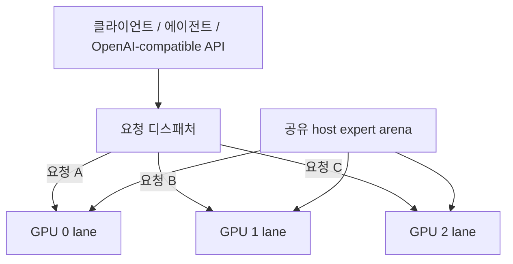

# Strata GPU-per-Lane 병렬 서빙 레시피

[English](README.md) | **한국어** | [简体中文](README.zh-CN.md) | [日本語](README.ja.md)

이 저장소는 **GPU 한 장당 독립 Strata generation lane 하나**를 두고, 큰 host-RAM expert arena는 lane들이 **물리적으로 한 벌만 공유**하는 서빙 패턴을 설명한다.

실측 기준 시스템은 **RTX 5070 Ti 16 GB ×3 + Qwen3.8-Flash-Next IQ3_XXS**지만, 설계 자체는 3장이나 특정 GPU에 종속되지 않는다. 각 GPU가 lane-local runtime을 담을 수 있고 CPU/RAM/PCIe 여유가 있다면 2장·3장·4장 이상, 혼합 GPU에도 적용할 수 있다.

구현: [`rhgo1749/Strata`](https://github.com/rhgo1749/Strata)  
정리된 기준 구현 커밋: [`844d6206`](https://github.com/rhgo1749/Strata/commit/844d62064b4327f80eae0f2980ccbd83b04fbe9a)

## 핵심 개념

**요청 하나는 GPU lane 하나가 처리하고, 여러 요청은 서로 다른 GPU에서 동시에 처리한다. 시스템 RAM의 큰 expert weight는 프로세스마다 복제하지 않고 공유한다.**

Tensor parallel이 아니라 request/session parallelism이다.



### 공유되는 것

- 큰 host expert arena의 물리 RAM 페이지;
- host memory bandwidth와 CPU 자원;
- PCIe/root-complex bandwidth;
- runtime storage.

### lane마다 독립인 것

- CUDA context/stream;
- GPU hot-expert cache;
- GPU-resident KV;
- host-KV/session state;
- generation/decode loop.

정상 production 경로에서는 GPU 사이에 token-by-token 동기화를 요구하지 않는다.

## 이 구조의 장점과 대가

- 느린 GPU가 다른 GPU의 매 token 진행을 끌어내리지 않는다.
- 서로 다른 성능의 GPU도 독립 request slot으로 쓰기 쉽다.
- 큰 RAM expert weight를 lane 수만큼 물리 복제하지 않는다.
- lane별 context/KV/CPU/PCIe/clock/undervolt tuning이 가능하다.
- NVLink가 없어도 정상 decode 경로가 성립한다.

대신 **요청 하나는 보통 GPU 하나만 쓴다.** 요청이 하나뿐이면 다른 GPU lane은 놀 수 있다. 따라서 이 구조는 single-request 최대 속도보다 **동시 요청 처리량과 격리성**을 우선한다.

## 기준 시스템

```text
CPU                 Ryzen 9 9950X3D, 16C/32T
RAM                 128 GB DDR5
GPUs                RTX 5070 Ti 16 GB ×3
PCIe                Gen5 x8 / x4 / x8
model               Qwen3.8-Flash-Next IQ3_XXS
contexts            262144 / 262144 / 262144
host-KV guard       786432
resident KV         32768 / 32768 / 32768
CPU cores           5 / 6 / 5
pcie-frac           0.55 / 0.25 / 0.55
shared expert arena ~39.97 GiB
```

이 값들은 **다른 PC의 기본값이 아니다.** 기준 시스템에서 실측 후 선택한 값이다.

주요 실측:

- 2차 언더볼팅 전 warm aggregate: **216.1 tok/s**, 최고 round **221.1 tok/s**;
- 장문 prompt processing: lane당 대략 **1.5–1.6k tok/s**;
- 약 **141K–145K token**짜리 장문 요청 3개 동시 완료;
- 2차 언더볼팅 후 lane-local warm: **78.8 / 78.4 / 80.1 tok/s**.

자세한 수치와 주의점은 [`RESULTS.md`](RESULTS.md), [`docs/reference-host-validation-20260929.md`](docs/reference-host-validation-20260929.md)를 보면 된다.

## 내 PC에 적용하는 순서

1. 먼저 single-GPU Strata 설정 하나를 정상 동작시킨다.
2. 각 GPU의 VRAM, PCIe link, 상대 성능을 확인한다.
3. 선택한 GPU 각각이 lane 하나의 VRAM 요구량을 감당하는지 확인한다.
4. lane들의 CPU worker가 같은 physical core를 겹쳐 쓰지 않게 나눈다.
5. 각 lane 단독 → 2개 동시 → 전체 동시 순으로 측정한다.
6. 짧은 warm prompt뿐 아니라 긴 cold prompt도 검증한다.
7. streaming, tool call, cancellation, lane recovery까지 통과시킨 뒤 production 값으로 승격한다.

기준 3-lane 실행 예시는 [`recipe/launch-3lane.sh.example`](recipe/launch-3lane.sh.example)에 있다.

## 구현 저장소와 레시피 저장소의 역할

`rhgo1749/Strata` 포크에는 공유 arena, multi-lane supervisor, request router, 테스트, 범용 architecture/roadmap만 둔다.

**특정 PC의 GPU 구성, CPU split, PCIe tuning, KV 값, 벤치마크 결과는 이 레시피 저장소가 담당한다.**

관계와 구현 위치는 [`docs/fork-and-implementation.md`](docs/fork-and-implementation.md)에 정리돼 있다.

## 현재 production 경로에서 하지 않는 것

- tensor parallel;
- pipeline parallel;
- 필수 cross-GPU expert ownership;
- GPU 간 KV migration;
- dynamic shared KV allocator;
- single-process multi-GPU decode.

이들은 자동 업그레이드 경로가 아니라, 실제 end-to-end 측정으로 현재 lane 구조를 이길 때만 승격할 challenger다.

## 문서 지도

- [`RESULTS.md`](RESULTS.md) — 기준 시스템 실측 결과
- [`docs/reference-host-validation-20260929.md`](docs/reference-host-validation-20260929.md) — 개인정보성 식별자를 뺀 기준 시스템 검증 기록
- [`docs/fork-and-implementation.md`](docs/fork-and-implementation.md) — 포크와 레시피의 역할 분리
- [`docs/undervolt-v2-20260929.md`](docs/undervolt-v2-20260929.md) — 2차 언더볼팅 데이터
- [`bench/README.md`](bench/README.md) — 측정 규칙

## 관련 프로젝트

- Upstream Strata: [`Niko1221/Strata`](https://github.com/Niko1221/Strata)
- Multi-lane 구현 포크: [`rhgo1749/Strata`](https://github.com/rhgo1749/Strata)
- ExLlamaV3 companion recipe: [`rhgo1749/qwen3.8-flash-next-exllamav3-3x5070ti-recipe`](https://github.com/rhgo1749/qwen3.8-flash-next-exllamav3-3x5070ti-recipe)

## License

이 저장소의 recipe 문서와 helper material은 MIT License를 따른다. Strata와 모델 파일은 각각의 원 라이선스를 따른다.
