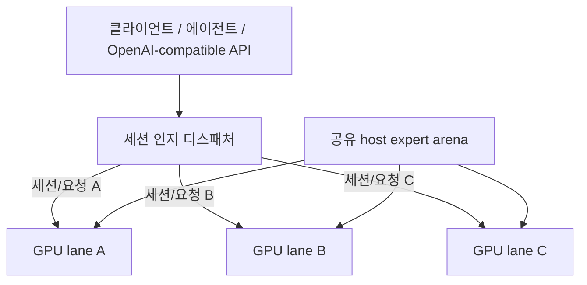

# Qwen3.8-Flash-Next / Strata GPU-per-Lane 병렬 서빙 레시피

[English](README.md) | **한국어** | [简体中文](README.zh-CN.md) | [日本語](README.ja.md)

이 저장소는 **GPU 한 장당 독립 Strata generation lane 하나**를 두고, lane 프로세스들이 큰 host-RAM expert arena는 **물리적으로 한 벌만 공유**하는 서빙 구조를 정리한다.

## 현재 상태

- 구현 포크: [`rhgo1749/Strata`](https://github.com/rhgo1749/Strata)
- **현재 운용 Strata pin:** [`ae74f43`](https://github.com/rhgo1749/Strata/commit/ae74f431259e03749f598b137dea92e155d867ae)
- 엔진 기준: Strata **0.1.27** (upstream `a790805`)
- 기준 서버 현재 production quant: **Qwen3.8-Flash-Next GSQ-RCO IQ3_S**
- 동결된 paper-v1 recipe snapshot: [`f54597a`](https://github.com/rhgo1749/qwen3.8-flash-next-strata-gpu-per-lane-recipe/commit/f54597a071e56bb0412685c46c4d604d50e26e45), branch `paper-v1`
- 동결된 paper-v1 Strata 구현 pin: [`6cf101d`](https://github.com/rhgo1749/Strata/commit/6cf101d5b98523cbaefc34a199faa5657c5c2719)

`main`은 논문 제출 이후 계속 움직이는 **운용/개발 브랜치**다. `main`이 바뀌어도 **paper-v1의 측정 결과와 재현 pin은 소급 변경하지 않는다.** 논문 v1을 재현할 때는 위 동결 snapshot과 구현 pin을 사용한다.

상세 실측 결과는 [`RESULTS.md`](RESULTS.md)에 유지한다. 논문 이후 x4 vision-lane 실험은 [`recipe/vision-x4-lane.md`](recipe/vision-x4-lane.md)에 분리돼 있다.

## 핵심 구조

**활성 요청 하나는 GPU lane 하나가 처리하고, 여러 요청은 서로 다른 GPU에서 동시에 처리한다. 시스템 RAM의 큰 expert weight는 프로세스마다 복제하지 않고 공유한다.**



CUDA 상태, GPU hot-expert cache, GPU-resident KV, host-KV/session 상태, speculative/MTP 상태, generation loop는 lane별로 독립이다. 정상 production 경로에는 필수 token-by-token cross-GPU 동기화가 없고 NVLink도 필요하지 않다.

## 논문 이후 세션 인지 스케줄러

초기 multi-lane supervisor는 request-level free-lane/round-robin 방식이었다. 독립 요청 throughput 실험에서는 문제가 없지만, KV/prompt cache가 lane-local인 상황에서 긴 대화의 다음 턴이 다른 GPU로 이동하면 전체 또는 대규모 prompt re-prefill을 다시 치를 수 있다.

현재 `main`은 **session affinity + live-state-aware placement**를 사용한다. 우선순위는 명시적으로 다음과 같다.

1. 먼저 살아 있고 capability 조건(예: vision)을 만족하는 lane만 후보로 남긴다.
2. 이미 알려진 세션이면 그 세션이 기억하고 있는 lane을 사용한다. 그 lane이 busy면 **다른 GPU로 도망가지 않고 그 lane 뒤에서 기다린다.**
3. 완전히 새로운 세션은 이미 busy인 lane에 끼어들지 않는다. 모든 후보가 busy면 request/stream 하나가 완전히 끝나 lane을 release할 때까지 기다린다.
4. idle 후보 중 live conversation state가 없는 lane을 가장 먼저 쓴다.
5. 모든 idle 후보에 live state가 있으면 **현재 live request state가 가장 작은 lane**을 선택해 덮어쓰는 prompt-cache locality 비용을 최소화한다.
6. 비용이 같으면 **가장 오래 쓰지 않은 live state(LRU)** 를 우선하고, 마지막 동률은 rotating cursor로 공정하게 푼다.

대기 중인 새 세션은 **compatible FIFO ticket**으로 줄을 선다. 먼저 기다린 compatible 요청이 새로 풀린 lane을 먼저 받고, vision 같은 capability 제약 요청은 자신이 쓸 수 없는 다른 lane까지 막지 않는다. 기존 세션 continuation이 자기 lane을 기다리는 동안에는 그 lane을 예약하므로 `notify_all()` wake-up race 때문에 새 세션이 cache-rich lane을 가로채지 못한다. 실제 빈 live state는 affinity key 유무가 아니라 `live_request_bytes == 0`으로 판정한다.

이 정책에는 **GPU 번호, GPU 모델, PCIe 폭을 하드코딩하지 않는다.** `busy` 수명은 request/stream 단위이고, affinity 수명은 session 단위다. 하나의 engine에 여러 session key가 기억될 수 있어, 중간에 다른 요청이 그 engine을 사용하더라도 예전 세션이 같은 engine으로 돌아와 Strata의 per-engine prompt-cache checkpoint를 다시 활용할 수 있다.

실 production smoke에서는 A → B → C → D → A 순서로 검증했다. A/B/C가 각각 빈 lane을 채운 뒤 D는 live state가 가장 작은 lane을 사용했고, 마지막 A는 다시 원래 lane으로 돌아왔다. 별도의 overload smoke에서는 3개 요청으로 세 lane을 모두 점유한 상태에서 4개 요청을 추가해 `peak_queue_depth=4`를 관측했고, 7개 요청 모두 성공한 뒤 `queue_depth=0`, 모든 lane idle로 정상 복귀했다.

이 스케줄러는 **현재 lane-local KV 구조를 안전하게 운용하기 위한 serving hardening**이며, 최종 최적 스케줄러라고 주장하지 않는다. cache-aware global scheduling, migration/transfer cost, overload queueing, 더 정교한 cost model은 로드맵 과제로 남긴다.

## 기준 시스템

```text
CPU                 Ryzen 9 9950X3D, 16C/32T
RAM                 128 GB DDR5
GPU lanes           RTX 5070 Ti 16 GB ×3
PCIe                x8 / x4 / x8
contexts            262144 / 262144 / 262144
resident KV         32768 / 32768 / 32768
physical CPU cores  5 / 6 / 5
production vision   선택된 lane 1개
current quant       IQ3_S
```

이 값들은 **다른 PC의 기본값이 아니라 기준 시스템의 실측값**이다.

host RAM은 대략 다음처럼 잡는다.

```text
필요 host RAM ≈ shared expert arena 1벌 + 모든 lane의 host-KV + OS/runtime 여유
```

## 논문 증거 경계

제출된 paper-v1 증거는 recipe snapshot `f54597a`와 Strata `6cf101d`에 고정돼 있다. 여기에는 1→2→3 lane scaling, shared-vs-private arena PSS, heterogeneous isolation, workload sensitivity, mixed-serving 결과가 포함된다. 논문 이후 `main`에 들어온 vision/scheduler 변경은 **paper-v1 결과에 소급 반영하지 않는다.**

참고:

- [`RESULTS.md`](RESULTS.md) — 보존된 benchmark evidence
- [`docs/fork-and-implementation.md`](docs/fork-and-implementation.md) — 구현/레시피 소유권과 재현 경계
- [`docs/paper-v1-reproducibility.md`](docs/paper-v1-reproducibility.md) — 동결된 v1 재현 링크
- [`recipe/vision-x4-lane.md`](recipe/vision-x4-lane.md) — post-v1 vision-lane 실험

## 다른 PC에 적용할 때

1. 사용할 GPU 각각에서 single-GPU Strata를 먼저 정상화한다.
2. VRAM, negotiated PCIe link, RAM 여유, CPU topology를 확인한다.
3. lane worker pool이 겹치지 않도록 physical CPU core를 나눈다.
4. 보수적인 context/resident-KV 값으로 시작해 각 lane을 단독 검증한다.
5. 동시 lane, cold/no-reuse 장문, streaming/cancellation, lane recovery, **multi-turn session affinity**를 검증한다.
6. 기준 서버의 tuning 값은 portable default가 아니라 측정값으로 취급한다.

## 관련 프로젝트

- Upstream Strata: [`Niko1221/Strata`](https://github.com/Niko1221/Strata)
- Multi-lane 구현 포크: [`rhgo1749/Strata`](https://github.com/rhgo1749/Strata)
- ExLlamaV3 companion recipe: [`rhgo1749/qwen3.8-flash-next-exllamav3-3x5070ti-recipe`](https://github.com/rhgo1749/qwen3.8-flash-next-exllamav3-3x5070ti-recipe)

## 라이선스

이 저장소의 recipe 문서와 helper material은 MIT 라이선스다. Strata와 모델 파일은 각각의 원래 라이선스를 따른다.