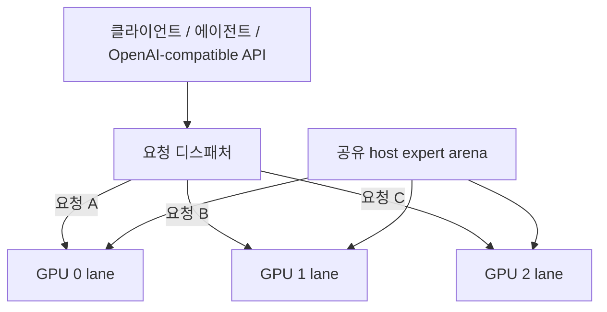

# Qwen3.8-Flash-Next / Strata GPU-per-Lane 병렬 서빙 레시피

[English](README.md) | **한국어** | [简体中文](README.zh-CN.md) | [日本語](README.ja.md)

이 저장소는 **GPU 한 장당 독립 Strata generation lane 하나**를 두고, 큰 host-RAM expert arena는 lane들이 **물리적으로 한 벌만 공유**하는 서빙 패턴을 설명한다.

실측 기준 시스템은 **RTX 5070 Ti 16 GB ×3**다. IQ3_XXS는 성능 비교용 기준으로 유지하고, 현재 기준 시스템의 실제 배포 모델은 **Qwen3.8-Flash-Next GSQ-RCO IQ3_S**다.

구현: [`rhgo1749/Strata`](https://github.com/rhgo1749/Strata)  
**현재 승격된 구현 pin:** [`3824f04`](https://github.com/rhgo1749/Strata/commit/3824f04003b79609a7cc6861ea5b4652a47d2ddb)  
**0.1.24 통합 merge:** [`82a5161`](https://github.com/rhgo1749/Strata/commit/82a51614517392f2c5b83af7c39ffbb7abbc783e)  
**현재 승격 엔진:** Strata **0.1.24**

## 핵심 개념

**요청 하나는 GPU lane 하나가 처리하고, 여러 요청은 서로 다른 GPU에서 동시에 처리한다. 시스템 RAM의 큰 expert weight는 프로세스마다 복제하지 않고 공유한다.**



### 공유되는 것

- host expert arena의 물리 RAM 페이지 1벌;
- host memory bandwidth와 CPU 자원;
- PCIe/root-complex bandwidth;
- runtime storage.

### lane마다 독립인 것

- CUDA context/stream;
- GPU hot-expert cache와 adaptive replacement 상태;
- GPU-resident KV;
- host-KV/session state;
- speculative/MTP state;
- generation/decode loop.

정상 production 경로에서는 GPU 사이에 token-by-token 동기화를 요구하지 않는다.

## 이 구조를 유지하는 이유

| 특성 | 실제 효과 |
| --- | --- |
| 느린 GPU는 자기 lane에 격리 | 느린 카드가 다른 lane의 매 token 진행을 끌어내리지 않음 |
| 혼합 GPU 사용 가능 | 서로 다른 성능의 GPU도 독립 request slot로 활용 가능 |
| host expert 공유 | 가장 큰 RAM 할당을 lane 수만큼 복제하지 않음 |
| failure isolation | 한 lane 장애가 모든 token step의 공통 장애영역이 되지 않음 |
| lane별 tuning 가능 | context/KV/CPU/PCIe/clock/undervolt를 lane별로 조정 가능 |
| NVLink 불필요 | 정상 decode가 필수 GPU-to-GPU 전송에 의존하지 않음 |

대신 **요청 하나는 보통 GPU 하나만 쓴다.** 따라서 이 구조는 single-request 최대속도보다 **동시 요청 처리량과 격리성**을 우선한다.

## 기준 시스템

```text
CPU                 Ryzen 9 9950X3D, 16C/32T
RAM                 128 GB DDR5
GPUs                RTX 5070 Ti 16 GB ×3
PCIe                Gen5 x8 / x4 / x8
contexts            262144 / 262144 / 262144
host-KV guard       786432
resident KV         32768 / 32768 / 32768
CPU cores           5 / 6 / 5
pcie-frac           0.55 / 0.25 / 0.55
GPU V/F plateau     2300 MHz @ >=875 mV
VRAM offset         +2500
```

이 값들은 **다른 PC의 기본값이 아니라 기준 시스템에서 실측해 선택한 값**이다.

RAM은 대략 다음 식으로 잡는다.

```text
필요 host RAM ≈
    shared expert arena 1벌
  + 모든 lane의 host-KV
  + OS / server / filesystem-cache 여유
```

expert arena는 GPU 수만큼 곱하지 않는다. 이 포크가 바로 그 큰 arena를 물리 RAM에서 공유한다.

## 현재 승격 성능 — Strata 0.1.24

0.1.24 승격은 기존 3-lane launch contract를 그대로 유지했고, **server/multi-GPU 테스트 52개**, production CUDA build, 두 quantization의 per-lane/layer-split 벤치, IQ3_S 약 140K no-reuse ×3 동시 장문 검증을 통과했다.

### IQ3_XXS — 독립 lane

- clean warm 3-request wall aggregate: **218.4–233.7 tok/s**, 평균 **225.5 tok/s**
- 15K no-reuse PP x8 / x4 / x8: **2453.5 / 2046.0 / 2450.8 tok/s**

### IQ3_XXS — upstream 3-GPU layer-split

- clean warm single-request decode: **93.5–99.9 tok/s**
- 15K no-reuse PP: **1144.4 tok/s**

### IQ3_S — 독립 lane

- clean warm 3-request wall aggregate: **176.8–199.4 tok/s**, 평균 **187.1 tok/s**
- 15K no-reuse PP x8 / x4 / x8: **2381.8 / 1852.2 / 2371.8 tok/s**
- 약 140K no-reuse 요청을 3 lane에 동시에 실행: **CUDA OOM / lane death 없이 완료**

### IQ3_S — upstream 3-GPU layer-split

- clean warm single-request decode: **74.2–81.7 tok/s**
- 15K no-reuse PP: **938.0 tok/s**

두 구조는 목적이 다르다. layer-split은 여러 GPU를 결합해 요청 하나를 처리하고, GPU-per-lane은 여러 독립 요청을 동시에 처리하면서 느린 카드가 모든 token step의 pace setter가 되지 않게 한다. 현재 목표인 concurrent agent serving에서는 **independent lane을 production baseline으로 유지하고, layer-split은 single-request challenger로 유지한다.**

상세 승격 기록: [`docs/strata-0.1.24-promotion-20260930.md`](docs/strata-0.1.24-promotion-20260930.md)

## Adaptive hot-expert replacement — 0.1.24

Strata 0.1.24는 가득 찬 hot-expert cache도 현재 대화의 routing 분포에 맞게 적응시킬 수 있다. 기본 정책은 routing usage를 누적/감쇠하고, 4 round마다 최대 96개의 저가치 resident expert를 더 자주 호출되는 non-resident expert와 교체할 수 있다.

IQ3_S 단일 lane에서 512-token retained round 2개씩 비교한 결과:

| 모드 | 평균 TG | decode expert-cache hit rate |
| --- | ---: | ---: |
| Adaptive replacement | **69.43 tok/s** | **86.5–87%** |
| Static residency (`--adapt-swaps 0`) | **54.14 tok/s** | 약 **61%** |

이 workload에서의 실측 개선은 **+28.3%**다. 모든 prompt/GPU/quantization에서 동일한 비율을 보장한다는 뜻은 아니다.

### `miss → adaptive swap → GPU resident → 이후 GPU hit`

`STRATA_ADAPT_TRACE`로 상태 전이를 직접 계측했다. retained trace에는 **22,996 selection**, **22,900 residency publication**, **6,937개의 first-later-GPU-hit 관측**이 있다.

| 구간 | median | p95 | 가장 빠른 retained 관측 |
| --- | ---: | ---: | ---: |
| 선택된 swap의 H2D/event wall → residency publish | **33.876 ms** | 49.751 ms | 12.948 ms |
| first miss → residency publish | **10.716 s** | 26.602 s | 20.205 ms |
| residency publish → 이후 첫 GPU hit | **154.249 ms** | 1.228 s | **0.306 ms** |
| first miss → 이후 첫 GPU hit | **3.430 s** | 18.126 s | 57.284 ms |

여기서 `first miss → resident`는 **순수 PCIe 복사시간이 아니다.** 해당 expert가 충분한 routing evidence를 쌓아 기존 resident victim을 밀어낼 가치가 있다고 adaptive policy가 판단할 때까지의 대기시간이 포함된다. H2D/event 숫자 역시 여러 swap의 async copy/event 완료를 묶어 보는 runtime wall interval이므로 과거의 standalone memcpy microbenchmark와 같은 지표가 아니다.

반면 `resident → first later GPU hit`은 새 residency가 publish된 다음 해당 expert가 실제 GPU-resident path에서 다시 사용되기까지의 시간이다. 가장 빠른 관측은 약 **0.306 ms**, median은 약 **154 ms**였다.

즉 요청했던 **`miss → adaptive swap → GPU resident` 전이는 실제 runtime trace로 확인됐고**, 이후 GPU hit와 성능/hit-rate 개선까지 같이 관측됐다.

상세 해석: [`docs/strata-0.1.24-promotion-20260930.md`](docs/strata-0.1.24-promotion-20260930.md)  
machine-readable 요약: [`bench/adaptive-swap-20260930.csv`](bench/adaptive-swap-20260930.csv)

## Controlled systems ablation — IQ3_S

0.1.24 승격과 별개로, 기존의 아키텍처 자체를 검증한 controlled 결과도 유지한다.

| 질문 | 실측 결과 |
| --- | --- |
| 1 → 2 → 3 GPU decode scaling | **72.59 → 137.01 → 188.23 tok/s**, 2 GPU **1.887×**, 3 GPU **2.593×** |
| Parallel efficiency | 2 GPU **94.4%**, 3 GPU **86.4%** |
| Private → shared host arena | two-engine PSS **95.33 → 52.03 GiB**, **43.30 GiB / 45.4% 절감** |
| RTX 5070 Ti 단독 | **70.336 tok/s** |
| RTX 5060 Ti x4와 동시 구동 중 RTX 5070 Ti | **70.321 tok/s**, 실측 감소 **0.0215%** |
| 동시 RTX 5060 Ti x4 lane | **57.246 tok/s** |

heterogeneous isolation에서는 측정 오차 범위에서 **느린 RTX 5060 Ti lane이 동시에 돌아가도 RTX 5070 Ti lane의 decode throughput이 내려가지 않았다.**

과거 free-slot expert admission H2D microbenchmark는 5070 Ti x8에서 약 **0.081 ms pinned / 0.117 ms ordinary host memory**, 5060 Ti x4에서 **0.155 / 0.190 ms**였다. 이 숫자는 여전히 **빈 slot으로 단순 전송하는 비용**을 설명하는 데 유효하다. 다만 과거 문서의 “full cache에는 eviction이 없다”는 설명은 이제 historical behavior다. 0.1.24에서는 adaptive victim replacement가 존재한다.

상세 방법론: [`docs/systems-ablation-20260929.md`](docs/systems-ablation-20260929.md)  
trial-level 원시 관측값: [`bench/systems-ablation-20260929.csv`](bench/systems-ablation-20260929.csv)

## 역사적 0.1.22 기준

직전 promoted 0.1.22 결과는 비교용 history로 유지한다.

- IQ3_XXS clean warm aggregate: **226.5–227.9 tok/s**
- IQ3_XXS 15,064-token no-reuse PP: **2492.2 tok/s**
- IQ3_S clean warm aggregate: **183.9–209.7 tok/s**, 평균 **195.3 tok/s**
- IQ3_S 15K PP: **2325.6 / 1806.5 / 2293.0 tok/s**
- IQ3_S 30K PP: **2352.1 / 1812.9 / 2348.3 tok/s**

prompt generation이나 조건이 다른 데이터끼리는 strict version A/B로 해석하지 않는다.

## 장문 검증

두 세대의 long-context evidence를 유지한다.

- 0.1.22: 141,578 / 144,875 / 144,777 input-token 실제 software-review prompt를 3 lane에서 동시에 완료
- 0.1.24: 새 약 **140K no-reuse 요청을 IQ3_S 3 lane에서 동시에 완료**, OOM/lane death 없음

이 값들은 throughput headline이 아니라 **262K ×3 capacity/stability/client compatibility 검증**이다.

## 현재 production 상태

기준 서버는 현재 0.1.24 production build로 승격되어 있고 adaptive replacement는 기본값으로 켜져 있다.

```text
public proxy       127.0.0.1:8087
backend            127.0.0.1:18087
private lanes      127.0.0.1:19087-19089
engine             build-production-024/strata
quantization       IQ3_S
```

## 내 PC에 적용하는 순서

1. 사용할 GPU 각각에서 single-GPU Strata를 먼저 정상화한다.
2. 각 GPU의 VRAM, negotiated PCIe link, 상대 성능을 확인한다.
3. 선택한 GPU 각각이 lane 하나의 VRAM 요구량을 감당하는지 확인한다.
4. shared expert arena를 올린 뒤 시스템 RAM 여유를 확인한다.
5. lane worker들이 같은 physical core를 겹쳐 쓰지 않게 나눈다.
6. context / resident-KV / topology 값은 보수적으로 시작하고 lane 단독부터 측정한다.
7. 2개 동시 → 전체 동시 순으로 확장한다.
8. 짧은 warm prompt와 긴 cold/no-reuse prompt를 모두 검증한다.
9. streaming, tool call, cancellation, lane recovery까지 통과시킨 뒤 production으로 승격한다.

기준 실행 예시는 [`recipe/launch-3lane.sh.example`](recipe/launch-3lane.sh.example)에 있다.

## 문서 지도

- [`RESULTS.md`](RESULTS.md) — 현재/역사 기준 시스템 결과
- [`docs/strata-0.1.24-promotion-20260930.md`](docs/strata-0.1.24-promotion-20260930.md) — 현재 0.1.24 승격, per-lane/layer-split, adaptive replacement 결과
- [`bench/adaptive-swap-20260930.csv`](bench/adaptive-swap-20260930.csv) — adaptive timing/A-B machine-readable 요약
- [`docs/systems-ablation-20260929.md`](docs/systems-ablation-20260929.md) — scaling, RAM sharing, heterogeneous isolation, free-slot expert-admission controlled 결과
- [`bench/systems-ablation-20260929.csv`](bench/systems-ablation-20260929.csv) — systems-ablation trial 관측값
- [`docs/strata-0.1.22-promotion-20260929.md`](docs/strata-0.1.22-promotion-20260929.md) — 역사적 0.1.22 promotion
- [`docs/iq3-s-3lane-benchmark-20260929.md`](docs/iq3-s-3lane-benchmark-20260929.md) — IQ3_S 상세 벤치 기록
- [`docs/reference-host-validation-20260929.md`](docs/reference-host-validation-20260929.md) — 262K ×3 장문/서빙 검증
- [`docs/fork-and-implementation.md`](docs/fork-and-implementation.md) — 포크와 레시피의 역할 분리
- [`bench/README.md`](bench/README.md) — benchmark/reporting contract

## 관련 프로젝트

- Upstream Strata: [`Niko1221/Strata`](https://github.com/Niko1221/Strata)
- Multi-lane 구현 포크: [`rhgo1749/Strata`](https://github.com/rhgo1749/Strata)
- ExLlamaV3 companion recipe: [`rhgo1749/qwen3.8-flash-next-exllamav3-3x5070ti-recipe`](https://github.com/rhgo1749/qwen3.8-flash-next-exllamav3-3x5070ti-recipe)

## License

이 저장소의 recipe 문서와 helper material은 MIT License를 따른다. Strata와 모델 파일은 각각의 원 라이선스를 따른다.
