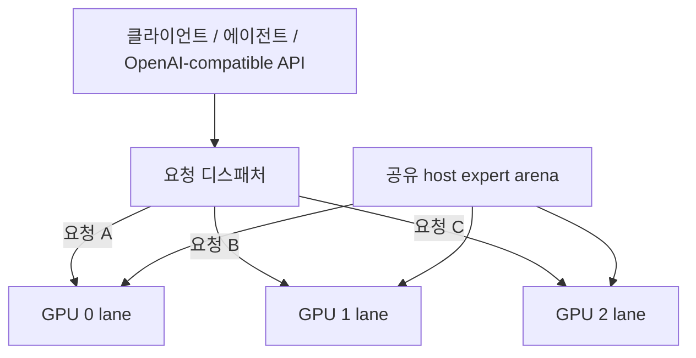

# Qwen3.8-Flash-Next / Strata GPU-per-Lane 병렬 서빙 레시피

[English](README.md) | **한국어** | [简体中文](README.zh-CN.md) | [日本語](README.ja.md)

이 저장소는 **GPU 한 장당 독립 Strata generation lane 하나**를 두고, 큰 host-RAM expert arena는 lane들이 **물리적으로 한 벌만 공유**하는 서빙 패턴을 설명한다.

실측 기준 시스템은 **RTX 5070 Ti 16 GB ×3**다. IQ3_XXS는 performance-oriented 비교 기준으로 유지하고, 현재 기준 시스템의 실제 배포 모델은 **Qwen3.8-Flash-Next GSQ-RCO IQ3_S**다.

구현: [`rhgo1749/Strata`](https://github.com/rhgo1749/Strata)  
**현재 승격된 구현 pin:** [`9dda206`](https://github.com/rhgo1749/Strata/commit/9dda206874387b20cac20837a1452f115a8f9f93)  
**현재 승격 엔진:** Strata **0.1.22**

## 핵심 개념

**요청 하나는 GPU lane 하나가 처리하고, 여러 요청은 서로 다른 GPU에서 동시에 처리한다. 시스템 RAM의 큰 expert weight는 프로세스마다 복제하지 않고 공유한다.**



### 공유되는 것

- host expert arena의 물리 RAM 페이지 1벌;
- host memory bandwidth와 CPU 자원;
- PCIe/root-complex bandwidth;
- runtime storage.

### lane마다 독립인 것

- CUDA context/stream;
- GPU hot-expert cache;
- GPU-resident KV;
- host-KV/session state;
- speculative/MTP state;
- generation/decode loop.

정상 production 경로에서는 GPU 사이에 token-by-token 동기화를 요구하지 않는다.

## 이 구조를 유지하는 이유

| 특성 | 실제 효과 |
| --- | --- |
| 느린 GPU는 자기 lane에 격리 | 느린 카드가 다른 lane의 매 token 진행을 끌어내리지 않음 |
| 혼합 GPU 사용 가능 | 서로 다른 성능의 GPU도 독립 request slot로 활용 가능 |
| host expert 공유 | 가장 큰 RAM 할당을 lane 수만큼 복제하지 않음 |
| failure isolation | 한 lane 장애가 모든 token step의 공통 장애영역이 되지 않음 |
| lane별 tuning 가능 | context/KV/CPU/PCIe/clock/undervolt를 lane별로 조정 가능 |
| NVLink 불필요 | 정상 decode가 필수 GPU-to-GPU 전송에 의존하지 않음 |

대신 **요청 하나는 보통 GPU 하나만 쓴다.** 따라서 이 구조는 single-request 최대속도보다 **동시 요청 처리량과 격리성**을 우선한다.

## 기준 시스템

```text
CPU                 Ryzen 9 9950X3D, 16C/32T
RAM                 128 GB DDR5
GPUs                RTX 5070 Ti 16 GB ×3
PCIe                Gen5 x8 / x4 / x8
contexts            262144 / 262144 / 262144
host-KV guard       786432
resident KV         32768 / 32768 / 32768
CPU cores           5 / 6 / 5
pcie-frac           0.55 / 0.25 / 0.55
GPU V/F plateau     2300 MHz @ >=875 mV
VRAM offset         +2500
```

이 값들은 **다른 PC의 기본값이 아니라 기준 시스템에서 실측해 선택한 값**이다.

RAM은 대략 다음 식으로 잡는다.

```text
필요 host RAM ≈
    shared expert arena 1벌
  + 모든 lane의 host-KV
  + OS / server / filesystem-cache 여유
```

expert arena는 GPU 수만큼 곱하지 않는다. 이 포크가 바로 그 큰 arena를 물리 RAM에서 공유한다.

## 현재 승격 성능 — Strata 0.1.22

현재 레시피 baseline은 fork commit `9dda206`, engine 0.1.22다. 기존 3-lane 실행 명령과 설정 계약은 그대로 호환됐고 별도 migration flag는 필요 없었다.

### IQ3_XXS performance reference

- clean warm 3-request wall aggregate: **226.5–227.9 tok/s**
- midpoint: 약 **227.2 tok/s**
- 15,064-token no-reuse single-lane PP spot check: **2,492.2 tok/s**

예전 237.3 tok/s IQ3_XXS 수치는 여전히 유효한 engine-reported lane-sum 역사값이지만 clean wall aggregate는 아니다.

### IQ3_S 현재 배포 벤치마크

현재 IQ3_S runtime은 Strata 0.1.22에서 **46.84 GiB** shared expert arena와 lane당 **4524 slots / 8.63 GiB** hot-expert cache를 사용한다.

두 backend session에서 유지한 clean warm round 4개는:

```text
183.9 / 190.8 / 196.8 / 209.7 tok/s wall aggregate
```

따라서 **현재 IQ3_S warm 범위는 183.9–209.7 tok/s, 4회 평균은 195.3 tok/s**다.

Concurrent no-reuse prompt processing:

| 측정 | GPU0 x8 | GPU1 x4 | GPU2 x8 |
| --- | ---: | ---: | ---: |
| 15,048-token PP | **2,325.6** | **1,806.5** | **2,293.0 tok/s** |
| 30,024-token PP | **2,352.1** | **1,812.9** | **2,348.3 tok/s** |

30K run의 x8 lane 평균은 **2,350.2 tok/s**, 가운데 x4 lane은 그보다 약 **22.9% 느렸다**. 유지한 장문 요청은 모두 **0 reused**였고 CUDA OOM, API failure, lane death 없이 완료했다.

과거 IQ3_S ~30K 데이터는 **1,553.7 / 1,323.9 / 1,545.1 tok/s**였다. 이번 0.1.22 수치는 그 역사 benchmark generation보다 대략 **+51.4% / +36.9% / +52.0%** 높다. 다만 prompt content와 runtime generation이 완전히 동일한 strict A/B는 아니므로 보편 speedup 주장으로 쓰지 않는다.

자세한 기록: [`docs/iq3-s-3lane-benchmark-20260929.md`](docs/iq3-s-3lane-benchmark-20260929.md)

### Controlled systems ablation — IQ3_S

아래는 기존 warm-throughput headline을 대체하는 값이 아니라 **아키텍처의 scaling / RAM sharing / heterogeneous isolation**을 따로 검증한 controlled benchmark다.

| 질문 | 실측 결과 |
| --- | --- |
| 1 → 2 → 3 GPU decode scaling | **72.59 → 137.01 → 188.23 tok/s**, 2 GPU **1.887×**, 3 GPU **2.593×** |
| Parallel efficiency | 2 GPU **94.4%**, 3 GPU **86.4%** |
| Private → shared host arena | two-engine PSS **95.33 → 52.03 GiB**, **43.30 GiB / 45.4% 절감** |
| RTX 5070 Ti 단독 | **70.336 tok/s** |
| RTX 5060 Ti x4와 동시 구동 중 RTX 5070 Ti | **70.321 tok/s**, 실측 감소 **0.0215%** |
| 동시 RTX 5060 Ti x4 lane | **57.246 tok/s** |

특히 heterogeneous isolation 결과가 인상적이다. 측정 오차 범위에서 **느린 RTX 5060 Ti lane이 동시에 돌아가도 RTX 5070 Ti lane의 decode throughput이 내려가지 않았다.** 즉 느린 카드가 전체 token step의 pace setter가 아니라 **자기 요청만 느리게 처리**하는 구조적 의도가 그대로 관측됐다.

빈 expert-cache slot에 expert 하나를 admission하는 H2D microbenchmark에서는 layer-weighted wall mean이 5070 Ti x8에서 약 **0.081 ms pinned / 0.117 ms ordinary host memory**, 5060 Ti x4에서 **0.155 / 0.190 ms**였다. 다만 이것은 **full-cache miss penalty가 아니다.** 현재 hot-expert cache에는 eviction이 없어서 cache가 가득 찬 뒤 non-resident expert는 CPU path로 fallback한다.

상세 방법론/주의사항: [`docs/systems-ablation-20260929.md`](docs/systems-ablation-20260929.md)  
trial-level 원시 관측값: [`bench/systems-ablation-20260929.csv`](bench/systems-ablation-20260929.csv)

### IQ3_XXS 0.1.21 대비

직전 0.1.21 integration 검증값은:

- warm 3-request wall aggregate: **198.2 tok/s**
- ~15K PP spot check: **1,609.9 tok/s**

IQ3_XXS 0.1.22 promotion run에서는 각각 약 **+14.6%**, **+54.8%**를 기록했다. 이 비율은 해당 promotion run끼리의 비교이며 모든 workload에 그대로 적용되는 보편 speedup 주장은 아니다.

자세한 promotion 기록: [`docs/strata-0.1.22-promotion-20260929.md`](docs/strata-0.1.22-promotion-20260929.md)

## upstream layer-split challenger

같은 `9dda206` 바이너리에서 upstream 3-GPU layer-split도 262K로 정상 기동했다.

- 짧은 single-request decode: **80.6 tok/s**
- 15,064-token no-reuse PP: **1,142.3 tok/s**

IQ3_XXS의 같은 15K PP probe에서 request-per-lane A는 약 **2.18×**의 PP를 보였고, layer-split B는 single-request decode에서 우위를 유지했다.

따라서 architecture promotion 판단은 그대로다. **동시 agent serving의 production baseline은 independent request lanes**, layer-split은 single-request 중심 workload를 위한 challenger로 남긴다.

## 262K ×3 장문 검증

실제 software-review prompt 3개를 모든 lane이 262K context로 설정된 상태에서 동시에 실행했다.

- 141,578 input / 992 output tokens
- 144,875 input / 1,295 output tokens
- 144,777 input / 871 output tokens

세 요청 모두 context overflow, CUDA OOM, API failure, lane death 없이 완료했다. 이 결과는 **262K ×3 capacity/client compatibility 검증**이며 throughput headline과는 분리한다.

## 내 PC에 적용하는 순서

1. 사용할 GPU 각각에서 single-GPU Strata를 먼저 정상화한다.
2. 각 GPU의 VRAM, negotiated PCIe link, 상대 성능을 확인한다.
3. 선택한 GPU 각각이 lane 하나의 VRAM 요구량을 감당하는지 확인한다.
4. shared expert arena를 올린 뒤 시스템 RAM 여유를 확인한다.
5. lane worker들이 같은 physical core를 겹쳐 쓰지 않게 나눈다.
6. context / resident-KV / topology 값은 보수적으로 시작하고 lane 단독부터 측정한다.
7. 2개 동시 → 전체 동시 순으로 확장한다.
8. 짧은 warm prompt와 긴 cold/no-reuse prompt를 모두 검증한다.
9. streaming, tool call, cancellation, lane recovery까지 통과시킨 뒤 production으로 승격한다.

기준 실행 예시는 [`recipe/launch-3lane.sh.example`](recipe/launch-3lane.sh.example)에 있다.

## 문서 지도

- [`RESULTS.md`](RESULTS.md) — 현재/역사 기준 시스템 실측 결과와 reporting rule
- [`docs/systems-ablation-20260929.md`](docs/systems-ablation-20260929.md) — scaling, RAM sharing, heterogeneous isolation, expert-admission controlled 결과
- [`bench/systems-ablation-20260929.csv`](bench/systems-ablation-20260929.csv) — systems ablation의 machine-readable trial 관측값
- [`docs/strata-0.1.22-promotion-20260929.md`](docs/strata-0.1.22-promotion-20260929.md) — 현재 0.1.22 promotion 기록
- [`docs/iq3-s-3lane-benchmark-20260929.md`](docs/iq3-s-3lane-benchmark-20260929.md) — 현재 IQ3_S benchmark
- [`docs/undervolt-v2-20260929.md`](docs/undervolt-v2-20260929.md) — 과거 2차 언더볼팅 lane-local 데이터
- [`docs/reference-host-validation-20260929.md`](docs/reference-host-validation-20260929.md) — 262K ×3 장문/서빙 검증
- [`docs/fork-and-implementation.md`](docs/fork-and-implementation.md) — 포크와 레시피의 역할 분리
- [`bench/README.md`](bench/README.md) — benchmark/reporting contract

## 관련 프로젝트

- Upstream Strata: [`Niko1221/Strata`](https://github.com/Niko1221/Strata)
- Multi-lane 구현 포크: [`rhgo1749/Strata`](https://github.com/rhgo1749/Strata)
- ExLlamaV3 companion recipe: [`rhgo1749/qwen3.8-flash-next-exllamav3-3x5070ti-recipe`](https://github.com/rhgo1749/qwen3.8-flash-next-exllamav3-3x5070ti-recipe)

## License

이 저장소의 recipe 문서와 helper material은 MIT License를 따른다. Strata와 모델 파일은 각각의 원 라이선스를 따른다.
