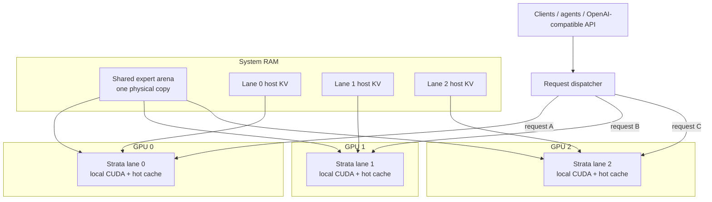

# Strata GPU-per-Lane Parallel Serving Recipe

**English** | [한국어](README.ko.md) | [简体中文](README.zh-CN.md) | [日本語](README.ja.md)

A practical recipe for running **one independent Strata generation lane per GPU** while sharing one large host-RAM expert arena between lanes.

The measured reference machine uses **3 × RTX 5070 Ti 16 GB** with Qwen3.8-Flash-Next IQ3_XXS, but the architecture is not tied to three GPUs or to one GPU model. The same pattern can be adapted to more or fewer GPUs, including mixed-performance GPUs, as long as every lane can fit its own GPU-resident runtime state and the host has enough CPU, RAM, and PCIe capacity.

Implementation: [`rhgo1749/Strata`](https://github.com/rhgo1749/Strata)  
Sanitized implementation pin: [`844d6206`](https://github.com/rhgo1749/Strata/commit/844d62064b4327f80eae0f2980ccbd83b04fbe9a)

## Core idea

**One request is processed by one GPU lane. Multiple requests run concurrently on different GPUs. The large expert weights in system RAM are physically shared instead of copied once per process.**

This is request/session parallelism, not tensor parallelism.



### What is shared

- the large host expert arena: one physical RAM copy;
- host memory bandwidth and CPU resources;
- PCIe/root-complex bandwidth;
- storage used by the runtime.

### What stays lane-local

- CUDA context and streams;
- GPU hot-expert cache;
- GPU-resident KV window;
- host-KV/session state;
- speculative/MTP state;
- generation request and decode loop.

There is no required token-by-token synchronization between GPUs in the production design.

## Why this architecture

| Property | Practical effect |
| --- | --- |
| Slower GPUs are isolated to their own lane | A slower card does not set every other lane's token rate. |
| Mixed GPUs are practical | Different-performance cards can serve independent requests. |
| Host expert weights are shared | Multiple processes do not need multiple physical RAM copies of the large expert arena. |
| Failure isolation is comparatively strong | One lane can fail or restart without turning every token step into a shared failure domain. |
| Per-lane tuning is possible | Context, resident KV, CPU allocation, PCIe fraction, clock and undervolt policy can differ by lane. |
| No NVLink is required | Normal decode does not depend on mandatory GPU-to-GPU transfers. |

The main trade-off is equally important: **one request normally uses one GPU lane**. If there is only one active request, the other generation lanes may be idle. This design optimizes concurrent serving and aggregate throughput rather than maximum single-request speed.

## Reference host

```text
CPU                 Ryzen 9 9950X3D, 16C/32T
RAM                 128 GB DDR5
GPUs                RTX 5070 Ti 16 GB ×3
PCIe                Gen5 x8 / x4 / x8
model               Qwen3.8-Flash-Next IQ3_XXS
contexts            262144 / 262144 / 262144
host-KV guard       786432
resident KV         32768 / 32768 / 32768
CPU cores           5 / 6 / 5
pcie-frac           0.55 / 0.25 / 0.55
shared expert arena ~39.97 GiB
```

These are **reference-host values, not universal defaults**.

Measured highlights include:

- pre-second-undervolt warm aggregate: **216.1 tok/s**, best observed round **221.1 tok/s**;
- long-context prompt processing: roughly **1.5–1.6k tok/s per lane**;
- three concurrent long-context requests of roughly **141K–145K tokens each** completed without context overflow, CUDA OOM, or lane death;
- second-undervolt lane-local warm result: **78.8 / 78.4 / 80.1 tok/s**.

See [`RESULTS.md`](RESULTS.md) and [`docs/reference-host-validation-20260929.md`](docs/reference-host-validation-20260929.md) for caveats and full measurements.

## How to adapt it to another PC

Do not copy the reference machine's `5/6/5` CPU split or `0.55/0.25/0.55` PCIe fractions blindly.

1. Get one normal single-GPU Strata configuration working first.
2. Inventory each GPU's VRAM, negotiated PCIe link, and expected relative performance.
3. Make sure every selected GPU can fit one complete lane runtime.
4. Partition physical CPU cores so lane worker pools do not overlap.
5. Start with conservative topology/cache settings and measure each lane alone.
6. Test two lanes, then all lanes concurrently.
7. Test cold long prompts as well as warm short prompts.
8. Validate streaming, tool calls, cancellation, and lane recovery before treating a configuration as production-ready.

The original measured three-lane launch example is in [`recipe/launch-3lane.sh.example`](recipe/launch-3lane.sh.example).

## Implementation relationship

The upstream engine stays responsible for the normal single-GPU numerical path. The implementation fork adds the shared arena, multi-lane supervisor, request-level routing, serving hardening, tests, and generic architecture contracts. This recipe repository owns **hardware-specific tuning and benchmark evidence**.

See [`docs/fork-and-implementation.md`](docs/fork-and-implementation.md) for the exact relationship.

## Current non-goals

The production path does not require:

- tensor parallelism;
- pipeline parallelism;
- mandatory cross-GPU expert ownership;
- GPU-to-GPU KV migration;
- a dynamic shared KV allocator;
- single-process multi-GPU decode.

Those remain architecture challengers rather than assumed upgrades. The implementation roadmap is maintained in [`rhgo1749/Strata`](https://github.com/rhgo1749/Strata/blob/main/docs/multigpu-roadmap.md).

## Repository map

- [`RESULTS.md`](RESULTS.md) — measured reference-host results
- [`docs/reference-host-validation-20260929.md`](docs/reference-host-validation-20260929.md) — sanitized host validation record
- [`docs/fork-and-implementation.md`](docs/fork-and-implementation.md) — fork/recipe ownership boundary
- [`docs/undervolt-v2-20260929.md`](docs/undervolt-v2-20260929.md) — second-undervolt dataset
- [`bench/README.md`](bench/README.md) — benchmark/reporting rules
- [`recipe/launch-3lane.sh.example`](recipe/launch-3lane.sh.example) — measured launch example

## Related projects

- Upstream Strata: [`Niko1221/Strata`](https://github.com/Niko1221/Strata)
- Multi-lane implementation fork: [`rhgo1749/Strata`](https://github.com/rhgo1749/Strata)
- ExLlamaV3 companion recipe: [`rhgo1749/qwen3.8-flash-next-exllamav3-3x5070ti-recipe`](https://github.com/rhgo1749/qwen3.8-flash-next-exllamav3-3x5070ti-recipe)

## License

Recipe documentation and helper material in this repository are MIT licensed. Strata and model files retain their own licenses.
