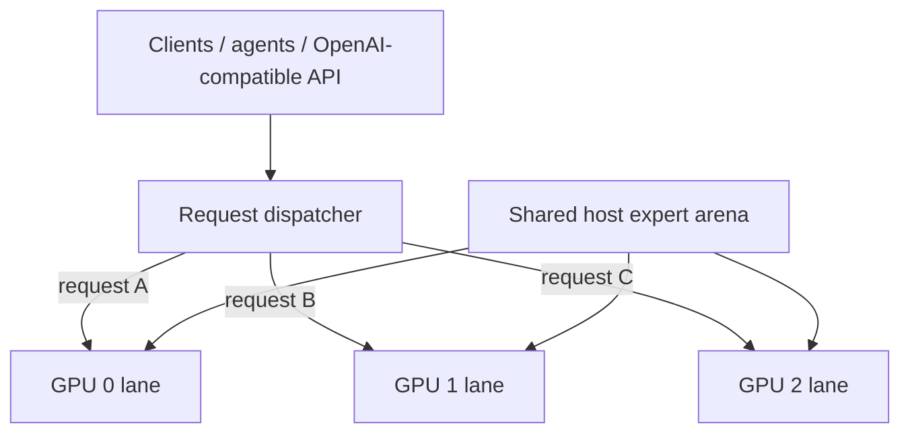

# Qwen3.8-Flash-Next / Strata GPU-per-Lane Parallel Serving Recipe

**English** | [한국어](README.ko.md) | [简体中文](README.zh-CN.md) | [日本語](README.ja.md)

A practical recipe for running **one independent Strata generation lane per GPU** while sharing one large host-RAM expert arena between lanes.

The measured reference machine uses **3 × RTX 5070 Ti 16 GB**. IQ3_XXS is kept as the performance-oriented comparison profile, while the current reference-host deployment uses **Qwen3.8-Flash-Next GSQ-RCO IQ3_S**.

Implementation: [`rhgo1749/Strata`](https://github.com/rhgo1749/Strata)  
**Current promoted implementation pin:** [`3824f04`](https://github.com/rhgo1749/Strata/commit/3824f04003b79609a7cc6861ea5b4652a47d2ddb)  
**0.1.24 integration merge:** [`82a5161`](https://github.com/rhgo1749/Strata/commit/82a51614517392f2c5b83af7c39ffbb7abbc783e)  
**Current promoted engine:** Strata **0.1.24**

## Core idea

**One request is processed by one GPU lane. Multiple requests run concurrently on different GPUs. The large expert weights in system RAM are physically shared instead of copied once per process.**



### Shared

- one physical host expert arena;
- host memory bandwidth and CPU resources;
- PCIe/root-complex bandwidth;
- runtime storage.

### Lane-local

- CUDA context and streams;
- GPU hot-expert cache and adaptive replacement state;
- GPU-resident KV window;
- host-KV/session state;
- speculative/MTP state;
- generation/decode loop.

There is no mandatory token-by-token cross-GPU synchronization in the production path.

## Why this architecture

| Property | Practical effect |
| --- | --- |
| Slower GPUs stay isolated to their lane | A slower card does not set every other lane's token rate. |
| Mixed GPUs are practical | Different cards can serve independent requests. |
| Host experts are shared | The largest RAM allocation is not duplicated once per lane. |
| Failure isolation stays comparatively strong | One lane can fail/restart without making every token step distributed. |
| Per-lane tuning is possible | Context, resident KV, CPU, PCIe fraction, clocks and undervolt can differ. |
| NVLink is not required | Normal decode does not depend on mandatory GPU-to-GPU transfers. |

The trade-off is explicit: **one active request normally uses one GPU lane**. This design targets concurrent serving and aggregate throughput rather than maximum single-request speed.

## Reference host

```text
CPU                 Ryzen 9 9950X3D, 16C/32T
RAM                 128 GB DDR5
GPUs                RTX 5070 Ti 16 GB ×3
PCIe                Gen5 x8 / x4 / x8
contexts            262144 / 262144 / 262144
host-KV guard       786432
resident KV         32768 / 32768 / 32768
CPU cores           5 / 6 / 5
pcie-frac           0.55 / 0.25 / 0.55
GPU V/F plateau     2300 MHz @ >=875 mV
VRAM offset         +2500
```

These are **reference-host values, not universal defaults**.

A useful sizing rule is:

```text
required host RAM ≈
    one shared expert arena
  + every lane's host-KV
  + OS / server / filesystem-cache headroom
```

Do **not** multiply the expert arena by GPU count; that is the allocation this fork physically shares.

## Current promoted performance — Strata 0.1.24

The 0.1.24 promotion preserved the existing three-lane launch contract and passed **52 server/multi-GPU tests**, the production CUDA build, both quantization benchmark matrices, and a concurrent ~140K-token no-reuse long-prompt check.

### IQ3_XXS — independent lanes

- clean warm three-request wall aggregate: **218.4–233.7 tok/s**, mean **225.5 tok/s**;
- 15K no-reuse PP, x8 / x4 / x8: **2453.5 / 2046.0 / 2450.8 tok/s**.

### IQ3_XXS — upstream 3-GPU layer-split

- clean warm single-request decode: **93.5–99.9 tok/s**;
- 15K no-reuse PP: **1144.4 tok/s**.

### IQ3_S — independent lanes

- clean warm three-request wall aggregate: **176.8–199.4 tok/s**, mean **187.1 tok/s**;
- 15K no-reuse PP, x8 / x4 / x8: **2381.8 / 1852.2 / 2371.8 tok/s**;
- ~140K no-reuse request on all three lanes concurrently: completed without CUDA OOM or lane death.

### IQ3_S — upstream 3-GPU layer-split

- clean warm single-request decode: **74.2–81.7 tok/s**;
- 15K no-reuse PP: **938.0 tok/s**.

These modes answer different questions. Layer-split improves a single request by coupling GPUs. GPU-per-lane serves multiple independent requests without making the slower card a mandatory token-step pace setter. For this recipe's concurrent-agent workload, **independent lanes remain the production baseline; layer-split remains the single-request challenger**.

Full promotion record: [`docs/strata-0.1.24-promotion-20260930.md`](docs/strata-0.1.24-promotion-20260930.md).

## Adaptive hot-expert replacement — 0.1.24

Strata 0.1.24 can adapt the full hot-expert cache to the current conversation. The default policy samples routing usage and, every four rounds, can replace up to 96 low-value resident experts with more frequently routed non-resident experts.

A controlled IQ3_S single-lane A/B retained two 512-token rounds per condition:

| Mode | Mean TG | Decode expert-cache hit rate |
| --- | ---: | ---: |
| Adaptive replacement | **69.43 tok/s** | **86.5–87%** |
| Static residency (`--adapt-swaps 0`) | **54.14 tok/s** | about **61%** |

Measured improvement on this workload: **+28.3%**.

This is a same-host workload result, not a universal speedup claim.

### `miss -> adaptive swap -> GPU resident -> later GPU hit`

`STRATA_ADAPT_TRACE` was used to timestamp the state transition directly. The retained trace observed **22,996 selections**, **22,900 residency publications**, and **6,937 first later GPU-hit observations**.

| Interval | median | p95 | fastest retained |
| --- | ---: | ---: | ---: |
| selected swap H2D/event wall -> residency publication | **33.876 ms** | 49.751 ms | 12.948 ms |
| first miss -> residency publication | **10.716 s** | 26.602 s | 20.205 ms |
| residency publication -> first later GPU hit | **154.249 ms** | 1.228 s | **0.306 ms** |
| first miss -> first later GPU hit | **3.430 s** | 18.126 s | 57.284 ms |

The long `first miss -> resident` interval is **not raw PCIe latency**: the adaptive policy first waits for enough routing evidence to justify evicting a current resident. Likewise, the H2D/event number is a batched runtime wall interval, not the old standalone memcpy microbenchmark.

Detailed timing interpretation: [`docs/strata-0.1.24-promotion-20260930.md`](docs/strata-0.1.24-promotion-20260930.md).  
Machine-readable summary: [`bench/adaptive-swap-20260930.csv`](bench/adaptive-swap-20260930.csv).

## Controlled systems ablations — IQ3_S

The earlier architecture experiments remain useful evidence independent of engine-version promotion.

| Question | Measured result |
| --- | --- |
| 1 → 2 → 3 GPU decode scaling | **72.59 → 137.01 → 188.23 tok/s**; 1.887× at 2 GPUs and 2.593× at 3 GPUs |
| Parallel efficiency | **94.4% at 2 GPUs**, **86.4% at 3 GPUs** |
| Private → shared host arena | **95.33 → 52.03 GiB** two-engine PSS; **43.30 GiB / 45.4% reduction** |
| RTX 5070 Ti alone | **70.336 tok/s** |
| RTX 5070 Ti while RTX 5060 Ti x4 also serves | **70.321 tok/s** (**0.0215% measured decrease**) |
| Concurrent RTX 5060 Ti x4 lane | **57.246 tok/s** |

The heterogeneous result is the clearest isolation check: within run-to-run noise, the slower RTX 5060 Ti lane did **not** reduce the RTX 5070 Ti lane's decode throughput.

The historical free-slot expert-admission microbenchmark measured layer-weighted H2D wall means of about **0.081 ms pinned / 0.117 ms ordinary host memory on the 5070 Ti x8**, and **0.155 / 0.190 ms on the 5060 Ti x4**. Those figures remain valid for **free-slot transfer only**. The old statement that a full cache never evicts is historical behavior; 0.1.24 now has adaptive victim replacement.

Full methodology: [`docs/systems-ablation-20260929.md`](docs/systems-ablation-20260929.md) and [`bench/systems-ablation-20260929.csv`](bench/systems-ablation-20260929.csv).

## Historical 0.1.22 reference

For version-to-version context, the prior promoted 0.1.22 results were:

- IQ3_XXS clean warm aggregate: **226.5–227.9 tok/s**;
- IQ3_XXS 15,064-token no-reuse PP spot check: **2492.2 tok/s**;
- IQ3_S clean warm aggregate: **183.9–209.7 tok/s**, mean **195.3 tok/s**;
- IQ3_S 15K PP: **2325.6 / 1806.5 / 2293.0 tok/s**;
- IQ3_S 30K PP: **2352.1 / 1812.9 / 2348.3 tok/s**.

Do not treat unmatched prompt generations as strict version A/Bs. Historical records remain in the older benchmark documents.

## Full-window validation

The recipe has retained two generations of long-context validation:

- 0.1.22: three concurrent real software-review prompts of **141,578 / 144,875 / 144,777 input tokens**, all completed without context overflow, CUDA OOM, API failure, or lane death;
- 0.1.24: a fresh **~140K no-reuse request on all three IQ3_S lanes concurrently**, again without OOM or lane death.

These are capacity/stability/client-compatibility checks, not throughput headlines.

## Production status

The reference server is now running the 0.1.24 production build with adaptive replacement enabled by default:

```text
public proxy       127.0.0.1:8087
backend            127.0.0.1:18087
private lanes      127.0.0.1:19087-19089
engine             build-production-024/strata
quantization       IQ3_S
```

## How to adapt it to another PC

1. Get one normal single-GPU Strata configuration working on every GPU you intend to use.
2. Inventory VRAM, negotiated PCIe links, and relative GPU performance.
3. Confirm each GPU can fit one complete lane runtime.
4. Confirm host-RAM headroom after the shared expert arena is loaded.
5. Partition physical CPU cores so lane worker pools do not overlap.
6. Start with conservative context / resident-KV / topology values and measure each lane alone.
7. Test two lanes, then all lanes concurrently.
8. Test cold long prompts as well as warm short prompts.
9. Validate streaming, tool calls, cancellation, and lane recovery before production promotion.

The measured launch example is in [`recipe/launch-3lane.sh.example`](recipe/launch-3lane.sh.example).

## Repository map

- [`RESULTS.md`](RESULTS.md) — current and historical reference-host results
- [`docs/strata-0.1.24-promotion-20260930.md`](docs/strata-0.1.24-promotion-20260930.md) — current 0.1.24 promotion, per-lane/layer-split and adaptive replacement evidence
- [`bench/adaptive-swap-20260930.csv`](bench/adaptive-swap-20260930.csv) — adaptive timing and A/B summary
- [`docs/systems-ablation-20260929.md`](docs/systems-ablation-20260929.md) — controlled scaling, RAM-sharing, heterogeneous-isolation and free-slot expert-admission results
- [`bench/systems-ablation-20260929.csv`](bench/systems-ablation-20260929.csv) — machine-readable systems-ablation observations
- [`docs/strata-0.1.22-promotion-20260929.md`](docs/strata-0.1.22-promotion-20260929.md) — historical 0.1.22 promotion
- [`docs/iq3-s-3lane-benchmark-20260929.md`](docs/iq3-s-3lane-benchmark-20260929.md) — historical/current-model IQ3_S benchmark details
- [`docs/reference-host-validation-20260929.md`](docs/reference-host-validation-20260929.md) — 262K ×3 serving validation
- [`docs/fork-and-implementation.md`](docs/fork-and-implementation.md) — fork/recipe ownership boundary
- [`bench/README.md`](bench/README.md) — benchmark/reporting contract

## Related projects

- Upstream Strata: [`Niko1221/Strata`](https://github.com/Niko1221/Strata)
- Multi-lane implementation fork: [`rhgo1749/Strata`](https://github.com/rhgo1749/Strata)
- ExLlamaV3 companion recipe: [`rhgo1749/qwen3.8-flash-next-exllamav3-3x5070ti-recipe`](https://github.com/rhgo1749/qwen3.8-flash-next-exllamav3-3x5070ti-recipe)

## License

Recipe documentation and helper material in this repository are MIT licensed. Strata and model files retain their own licenses.
