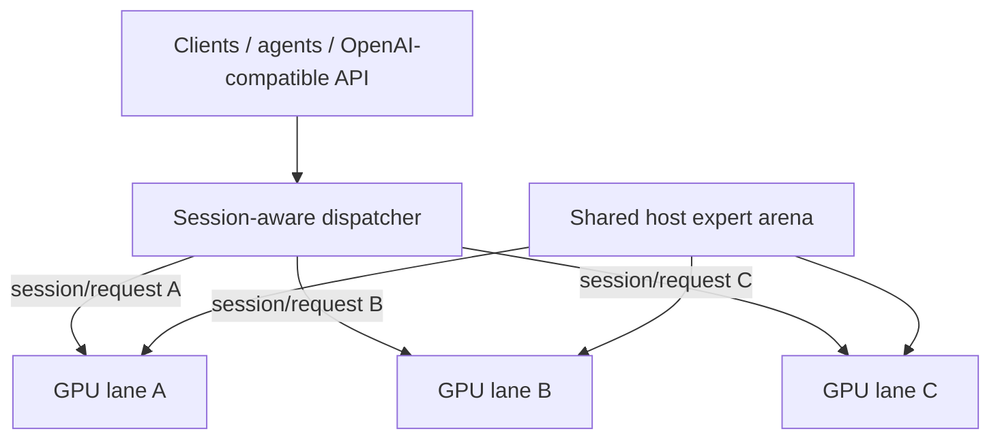

# Qwen3.8-Flash-Next / Strata GPU-per-Lane Parallel Serving Recipe

**English** | [한국어](README.ko.md) | [简体中文](README.zh-CN.md) | [日本語](README.ja.md)

A practical recipe for running **one independent Strata generation lane per GPU** while physically sharing one large host-RAM expert arena across lane processes.

**Upstream:** Strata is the inference engine created and maintained by [Niko1221](https://github.com/Niko1221) at [`Niko1221/Strata`](https://github.com/Niko1221/Strata). This repository documents the multi-lane serving and shared-arena extensions built on top of that engine.

## Current state

- Implementation fork: [`rhgo1749/Strata-Lanes`](https://github.com/rhgo1749/Strata-Lanes)
- **Current operational Strata pin:** [`8ea68ea`](https://github.com/rhgo1749/Strata-Lanes/commit/8ea68eaab3ee93f1c820f5103d64ca251cfe52b6)
- Engine baseline: Strata **0.1.38** (`99f3dbd` upstream); sync record: [`docs/strata-0.1.38-promotion-20261003.md`](docs/strata-0.1.38-promotion-20261003.md)
- Current production quant on the reference host: **Qwen3.8-Flash-Next GSQ-RCO IQ3_S**
`main` tracks the current operational recipe. Detailed retained measurements and version boundaries are in [`RESULTS.md`](RESULTS.md). Older snapshots remain available through Git history and named branches rather than being mirrored on the moving main branch.

## Core architecture

**One active request is processed by one GPU lane. Multiple requests run concurrently on different GPUs. The large expert weights in system RAM are physically shared rather than copied once per process.**



Lane-local state includes CUDA state, GPU hot-expert cache, GPU-resident KV, host-KV/session state, speculative/MTP state, and the generation loop. The normal production path has no mandatory token-by-token cross-GPU synchronization and does not require NVLink.

## Session-aware scheduler

The first multi-lane supervisor used request-level free-lane/round-robin scheduling. That is fine for independent throughput tests, but it can move a later turn of a long conversation to another GPU even though prompt/KV state is lane-local. On a real long session this caused a later turn to pay a full prompt re-prefill.

Current `main` uses **strict session affinity plus balanced-additive new-session placement**. The ordering is explicit:

1. Filter to healthy lanes that satisfy hard capabilities such as vision.
2. If the request belongs to a known session, use its remembered lane. If that lane is busy, **wait behind that lane instead of spilling to another GPU**.
3. A completely new session never enters an already-busy lane. If every eligible lane is busy, it waits until a request/stream fully releases a lane.
4. Among eligible idle lanes, first prefer the lane with the **fewest remembered affinity sessions** so long-lived cache state does not turn one lane into a permanent attractor.
5. Among equally balanced candidates, minimize **estimated new-prefill bytes + retained last-completed-request bytes**. This is an explicit routing-state proxy, not engine-truth compute cost.
6. Live-state recency and rotating candidate order remain tie-breakers. `safe-affinity-live-state-v1` remains the explicit rollback policy.

Queued new sessions use **compatible FIFO tickets**: an older compatible waiter gets a newly released lane first, while capability-constrained work such as vision does not block unrelated lanes. A remembered continuation waiting for its lane reserves that lane, so a `notify_all()` wake-up race cannot let a new session steal the cache-rich lane. An empty live state is defined by `live_request_bytes == 0`, not by the absence of an affinity key.

The policy is **hardware-agnostic**: it does not hard-code GPU number, GPU model, or PCIe width. `busy` is request/stream-scoped; affinity is session-scoped. Several session keys may remain mapped to the same engine so Strata can recover older per-engine prompt-cache checkpoints after intervening requests.

A production smoke after the fix exercised A → B → C → D → A: A/B/C filled separate lanes, D selected the lane with the smallest live state, and A still returned to its original lane. A separate overload smoke ran 3 active requests plus 4 queued requests, observed `peak_queue_depth=4`, and drained all 7 requests successfully back to `queue_depth=0` with all lanes idle.

This scheduler is **serving hardening for the current lane-local KV architecture, not claimed as the final optimal scheduler**. Cache-aware global scheduling, migration/transfer costs, overload queueing, and more explicit cost models remain roadmap work.

## Reference host

```text
CPU                 Ryzen 9 9950X3D, 16C/32T
RAM                 128 GB DDR5
GPU lanes           RTX 5070 Ti 16 GB ×3
PCIe                x8 / x4 / x8
contexts            262144 / 262144 / 262144
resident KV         32768 / 32768 / 32768
VRAM reserve MiB    1200 / 1200 / 1200
physical CPU cores  5 / 6 / 5
production vision   one selected lane
current quant       IQ3_S
```

These are **reference-host values, not universal defaults**.

### VRAM reserve caution for mixed vision/text lanes

When deriving text-only lanes from a vision-enabled base config, it is correct to remove `--vision` and the encoder configuration, but the VRAM safety margin must not disappear with them. On the reference RTX 5070 Ti 16 GB / IQ3_S / 262K-context / 32768 resident-KV setup, falling back to a 700 MiB reserve left only about **93 MiB** free after load and produced a real `verify: instantiate: out of memory` failure.

Production now sets `--lane-vram-reserve-mibs 1200,1200,1200`. A fresh remeasurement left **593 / 592 / 593 MiB** free on GPU0/GPU1/GPU2; three simultaneous public requests all returned HTTP 200, with no new OOM, illegal-memory, or engine-stop event after the new startup. The 1200 MiB value is a **reference-host safety value**, not a universal GPU default. The failure was exposed by mixed-capability lane derivation; it was not caused by the vision encoder consuming VRAM on the text-only GPUs.

A useful host-RAM rule is:

```text
required host RAM ≈ one shared expert arena + every lane's host-KV + OS/runtime headroom
```

## Versioned evidence

The moving `main` tracks the current **0.1.38 software baseline** and the current **0.1.38 full benchmark campaign**. The 0.1.31 Phase 3 lifecycle record and the 0.1.30 architecture matrix remain retained historical evidence under their original engine generations. Cross-version benchmark claims preserve their prompt/version boundaries rather than relabeling old measurements as current.

See:

- [`RESULTS.md`](RESULTS.md) — current summary and retained benchmark evidence
- [`docs/strata-0.1.38-full-campaign-20261003.md`](docs/strata-0.1.38-full-campaign-20261003.md) — current 0.1.38 full benchmark campaign
- [`docs/strata-0.1.38-promotion-20261003.md`](docs/strata-0.1.38-promotion-20261003.md) — 0.1.38 software-sync promotion and byte-matched bounded prefill A/B
- [`docs/strata-0.1.34-promotion-20261002.md`](docs/strata-0.1.34-promotion-20261002.md) — retained 0.1.34 software-sync promotion
- [`docs/strata-0.1.31-promotion-20261001.md`](docs/strata-0.1.31-promotion-20261001.md) — retained full live/parity evidence
- [`docs/strata-0.1.30-promotion-20261001.md`](docs/strata-0.1.30-promotion-20261001.md) — retained full benchmark generation
- [`docs/fork-and-implementation.md`](docs/fork-and-implementation.md) — upstream/fork/recipe ownership boundary

## Adapting the recipe

1. Make one normal single-GPU Strata lane work on every GPU first.
2. Verify VRAM, negotiated PCIe links, RAM headroom, and CPU topology.
3. Partition physical CPU cores so lane worker pools do not overlap.
4. Start with conservative context/resident-KV values and validate every lane independently.
5. Validate multiple concurrent lanes, cold/no-reuse long prompts, streaming/cancellation, lane recovery, and **multi-turn session affinity**.
6. Treat hardware-specific tuning values as measurements, not portable defaults.

## Related projects

- Upstream Strata: [`Niko1221/Strata`](https://github.com/Niko1221/Strata)
- Multi-lane implementation fork: [`rhgo1749/Strata-Lanes`](https://github.com/rhgo1749/Strata-Lanes)
- ExLlamaV3 companion recipe: [`rhgo1749/qwen3.8-flash-next-exllamav3-3x5070ti-recipe`](https://github.com/rhgo1749/qwen3.8-flash-next-exllamav3-3x5070ti-recipe)

## License

Recipe documentation and helper material in this repository are MIT licensed. Strata and model files retain their own licenses.