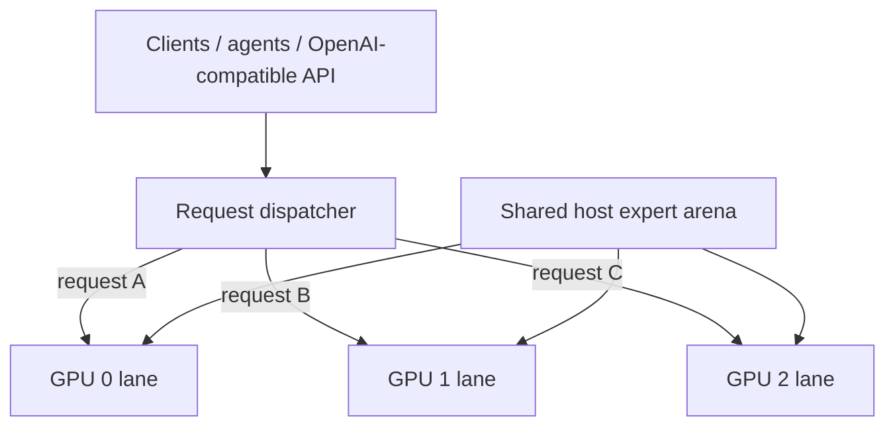

# Qwen3.8-Flash-Next / Strata GPU-per-Lane Parallel Serving Recipe

**English** | [한국어](README.ko.md) | [简体中文](README.zh-CN.md) | [日本語](README.ja.md)

A practical recipe for running **one independent Strata generation lane per GPU** while sharing one large host-RAM expert arena between lanes.

The measured reference machine uses **3 × RTX 5070 Ti 16 GB** with Qwen3.8-Flash-Next IQ3_XXS. The architecture is request/session parallelism, not tensor parallelism: one request normally runs on one GPU lane, while multiple requests run concurrently on different GPUs.

Implementation: [`rhgo1749/Strata`](https://github.com/rhgo1749/Strata)  
**Current promoted implementation pin:** [`9dda206`](https://github.com/rhgo1749/Strata/commit/9dda206874387b20cac20837a1452f115a8f9f93)  
**Current promoted engine:** Strata **0.1.22**

## Core idea

**One request is processed by one GPU lane. Multiple requests run concurrently on different GPUs. The large expert weights in system RAM are physically shared instead of copied once per process.**



### Shared

- one physical host expert arena;
- host memory bandwidth and CPU resources;
- PCIe/root-complex bandwidth;
- runtime storage.

### Lane-local

- CUDA context and streams;
- GPU hot-expert cache;
- GPU-resident KV window;
- host-KV/session state;
- speculative/MTP state;
- generation/decode loop.

There is no mandatory token-by-token cross-GPU synchronization in the production path.

## Why this architecture

| Property | Practical effect |
| --- | --- |
| Slower GPUs stay isolated to their lane | A slower card does not set every other lane's token rate. |
| Mixed GPUs are practical | Different cards can serve independent requests. |
| Host experts are shared | The largest RAM allocation is not duplicated once per lane. |
| Failure isolation stays comparatively strong | One lane can fail/restart without making every token step distributed. |
| Per-lane tuning is possible | Context, resident KV, CPU, PCIe fraction, clocks and undervolt can differ. |
| NVLink is not required | Normal decode does not depend on mandatory GPU-to-GPU transfers. |

The main trade-off is equally important: **one active request normally uses one GPU lane**. This design targets concurrent serving and aggregate throughput rather than maximum single-request speed.

## Reference host

```text
CPU                 Ryzen 9 9950X3D, 16C/32T
RAM                 128 GB DDR5
GPUs                RTX 5070 Ti 16 GB ×3
PCIe                Gen5 x8 / x4 / x8
model               Qwen3.8-Flash-Next IQ3_XXS
contexts            262144 / 262144 / 262144
host-KV guard       786432
resident KV         32768 / 32768 / 32768
CPU cores           5 / 6 / 5
pcie-frac           0.55 / 0.25 / 0.55
shared expert arena ~39.97 GiB
GPU V/F plateau     2300 MHz @ >=875 mV
VRAM offset         +2500
```

These are **reference-host values, not universal defaults**.

A useful sizing rule is:

> Every selected GPU must first be able to run one usable single-GPU Strata lane. The host then needs enough RAM, CPU and PCIe capacity for all lanes concurrently.

The host-RAM model is roughly:

```text
required host RAM ≈
    one shared expert arena
  + every lane's host-KV
  + OS / server / filesystem-cache headroom
```

Do **not** multiply the expert arena by GPU count; that is the allocation this fork physically shares.

## Current promoted performance — Strata 0.1.22

The current recipe baseline is fork commit `9dda206`, engine 0.1.22. The existing 3-lane launch contract remained compatible; no migration flag was required.

### Clean warm concurrent decode

Three identical short requests were warmed so all lanes could reuse the same short prefix. Two retained warm rounds measured:

- **227.9 tok/s** wall aggregate (384 completion tokens / 1.685 s)
- **226.5 tok/s** wall aggregate (384 completion tokens / 1.695 s)

**Current headline multi-lane result: 226.5–227.9 tok/s clean warm wall aggregate** (about 227.2 tok/s midpoint).

This replaces the older 237.3 tok/s lane-sum as the preferred headline metric because the new number is derived from one common wall interval. The old 237.3 tok/s observation remains valid historical lane-local evidence, but it was never a wall-clock aggregate.

### Current prompt-processing spot check

A no-reuse **15,064-token** prompt on one 262K lane processed at **2,492.2 tok/s**.

This is a promoted same-host 0.1.22 software-version spot check, not a universal long-prompt PP claim. Older 45K–65K prompt-processing observations remain useful historical data but are a different prompt-length/run generation.

### 0.1.21 comparison

The immediately preceding 0.1.21 integration validation measured:

- warm three-request wall aggregate: **198.2 tok/s**;
- ~15K prompt-processing spot check: **1,609.9 tok/s**.

The 0.1.22 promotion therefore measured about **+14.6%** warm wall aggregate and **+54.8%** on that retained ~15K PP comparison. These are promotion-run deltas, not universal model speedup claims.

Full promotion record: [`docs/strata-0.1.22-promotion-20260929.md`](docs/strata-0.1.22-promotion-20260929.md).

## Layer-split challenger

The same `9dda206` binary also preserves upstream Strata 3-GPU layer-split at 262K.

- short single-request decode: **80.6 tok/s**;
- 15,064-token no-reuse PP: **1,142.3 tok/s**.

On the retained 15K PP probe, the request-per-lane path measured about **2.18×** the layer-split PP rate. Layer-split still showed the expected single-request decode advantage.

The architecture decision therefore remains unchanged: **independent request lanes are the production baseline for concurrent-agent serving; layer-split remains a challenger for single-request-oriented workloads.**

## Full-window validation

Three real software-review prompts were run concurrently with every lane configured for a 262K context window:

- 141,578 input tokens / 992 output tokens
- 144,875 input tokens / 1,295 output tokens
- 144,777 input tokens / 871 output tokens

All three completed without context overflow, CUDA OOM, API failure, or lane death. This is retained as **262K ×3 capacity/client-compatibility evidence**, not as the canonical throughput benchmark.

## IQ3_S quality-oriented challenger

A clean three-lane IQ3_S run also validated the same 262K ×3 policy on the reference host.

| Measurement | IQ3_S result |
| --- | ---: |
| Shared host expert arena | **46.84 GiB** |
| Hot-expert cache per GPU | **4548 slots / 8.67 GiB** |
| Warm short-decode TG | **60.5 / 63.8 / 59.1 tok/s** |
| Engine-reported TG lane-sum | **183.4 tok/s** |
| Concurrent ~30K no-reuse PP | **1,553.7 / 1,323.9 / 1,545.1 tok/s** |

IQ3_S remains a quality-oriented challenger profile rather than the canonical performance profile.

## How to adapt it to another PC

1. Get one normal single-GPU Strata configuration working on every GPU you intend to use.
2. Inventory VRAM, negotiated PCIe links, and relative GPU performance.
3. Confirm each GPU can fit one complete lane runtime.
4. Confirm host-RAM headroom after the shared expert arena is loaded.
5. Partition physical CPU cores so lane worker pools do not overlap.
6. Start with conservative context / resident-KV / topology values and measure each lane alone.
7. Test two lanes, then all lanes concurrently.
8. Test cold long prompts as well as warm short prompts.
9. Validate streaming, tool calls, cancellation, and lane recovery before production promotion.

The measured launch example is in [`recipe/launch-3lane.sh.example`](recipe/launch-3lane.sh.example).

## Repository map

- [`RESULTS.md`](RESULTS.md) — current and historical reference-host results
- [`docs/strata-0.1.22-promotion-20260929.md`](docs/strata-0.1.22-promotion-20260929.md) — current 0.1.22 promotion record
- [`docs/undervolt-v2-20260929.md`](docs/undervolt-v2-20260929.md) — historical second-undervolt GPU tuning / lane-local dataset
- [`docs/iq3-s-3lane-benchmark-20260929.md`](docs/iq3-s-3lane-benchmark-20260929.md) — IQ3_S challenger benchmark
- [`docs/reference-host-validation-20260929.md`](docs/reference-host-validation-20260929.md) — 262K ×3 full-window serving validation
- [`docs/fork-and-implementation.md`](docs/fork-and-implementation.md) — fork/recipe ownership boundary
- [`bench/README.md`](bench/README.md) — benchmark/reporting contract

## Related projects

- Upstream Strata: [`Niko1221/Strata`](https://github.com/Niko1221/Strata)
- Multi-lane implementation fork: [`rhgo1749/Strata`](https://github.com/rhgo1749/Strata)
- ExLlamaV3 companion recipe: [`rhgo1749/qwen3.8-flash-next-exllamav3-3x5070ti-recipe`](https://github.com/rhgo1749/qwen3.8-flash-next-exllamav3-3x5070ti-recipe)

## License

Recipe documentation and helper material in this repository are MIT licensed. Strata and model files retain their own licenses.
