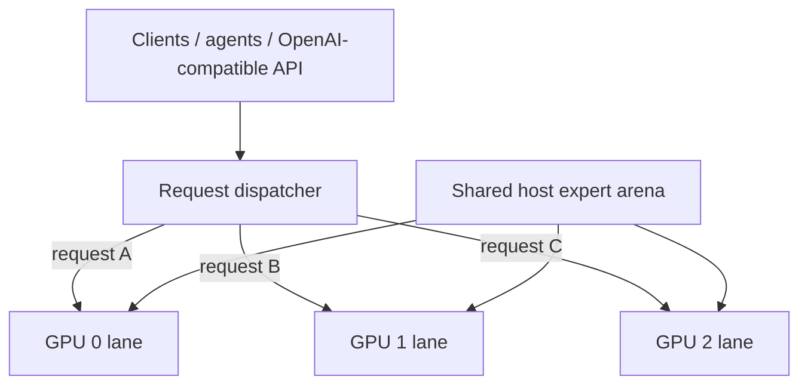

# Qwen3.8-Flash-Next / Strata GPU-per-Lane Parallel Serving Recipe

**English** | [한국어](README.ko.md) | [简体中文](README.zh-CN.md) | [日本語](README.ja.md)

A practical recipe for running **one independent Strata generation lane per GPU** while sharing one large host-RAM expert arena between lanes.

The measured reference machine uses **3 × RTX 5070 Ti 16 GB**. IQ3_XXS is kept as the performance-oriented comparison profile, while the current reference-host deployment uses **Qwen3.8-Flash-Next GSQ-RCO IQ3_S**.

Implementation: [`rhgo1749/Strata`](https://github.com/rhgo1749/Strata)  
**Current promoted implementation pin:** [`9dda206`](https://github.com/rhgo1749/Strata/commit/9dda206874387b20cac20837a1452f115a8f9f93)  
**Current promoted engine:** Strata **0.1.22**

## Core idea

**One request is processed by one GPU lane. Multiple requests run concurrently on different GPUs. The large expert weights in system RAM are physically shared instead of copied once per process.**



### Shared

- one physical host expert arena;
- host memory bandwidth and CPU resources;
- PCIe/root-complex bandwidth;
- runtime storage.

### Lane-local

- CUDA context and streams;
- GPU hot-expert cache;
- GPU-resident KV window;
- host-KV/session state;
- speculative/MTP state;
- generation/decode loop.

There is no mandatory token-by-token cross-GPU synchronization in the production path.

## Why this architecture

| Property | Practical effect |
| --- | --- |
| Slower GPUs stay isolated to their lane | A slower card does not set every other lane's token rate. |
| Mixed GPUs are practical | Different cards can serve independent requests. |
| Host experts are shared | The largest RAM allocation is not duplicated once per lane. |
| Failure isolation stays comparatively strong | One lane can fail/restart without making every token step distributed. |
| Per-lane tuning is possible | Context, resident KV, CPU, PCIe fraction, clocks and undervolt can differ. |
| NVLink is not required | Normal decode does not depend on mandatory GPU-to-GPU transfers. |

The main trade-off is equally important: **one active request normally uses one GPU lane**. This design targets concurrent serving and aggregate throughput rather than maximum single-request speed.

## Reference host

```text
CPU                 Ryzen 9 9950X3D, 16C/32T
RAM                 128 GB DDR5
GPUs                RTX 5070 Ti 16 GB ×3
PCIe                Gen5 x8 / x4 / x8
contexts            262144 / 262144 / 262144
host-KV guard       786432
resident KV         32768 / 32768 / 32768
CPU cores           5 / 6 / 5
pcie-frac           0.55 / 0.25 / 0.55
GPU V/F plateau     2300 MHz @ >=875 mV
VRAM offset         +2500
```

These are **reference-host values, not universal defaults**.

A useful sizing rule is:

> Every selected GPU must first be able to run one usable single-GPU Strata lane. The host then needs enough RAM, CPU and PCIe capacity for all lanes concurrently.

The host-RAM model is roughly:

```text
required host RAM ≈
    one shared expert arena
  + every lane's host-KV
  + OS / server / filesystem-cache headroom
```

Do **not** multiply the expert arena by GPU count; that is the allocation this fork physically shares.

## Current promoted performance — Strata 0.1.22

The current recipe baseline is fork commit `9dda206`, engine 0.1.22. The existing 3-lane launch contract remained compatible; no migration flag was required.

### IQ3_XXS performance reference

- clean warm three-request wall aggregate: **226.5–227.9 tok/s**;
- midpoint: about **227.2 tok/s**;
- no-reuse 15,064-token single-lane PP spot check: **2,492.2 tok/s**.

The older 237.3 tok/s IQ3_XXS value remains a historical engine-reported lane-sum, not a clean wall aggregate.

### IQ3_S current deployment benchmark

The current IQ3_S runtime uses a **46.84 GiB** shared expert arena and a **4524-slot / 8.63 GiB** hot-expert cache per lane on Strata 0.1.22.

Four retained clean warm rounds across two backend sessions measured:

```text
183.9 / 190.8 / 196.8 / 209.7 tok/s wall aggregate
```

**Current IQ3_S warm range: 183.9–209.7 tok/s, four-round mean 195.3 tok/s.**

Concurrent no-reuse prompt processing:

| Measurement | GPU0 x8 | GPU1 x4 | GPU2 x8 |
| --- | ---: | ---: | ---: |
| 15,048-token PP | **2,325.6** | **1,806.5** | **2,293.0 tok/s** |
| 30,024-token PP | **2,352.1** | **1,812.9** | **2,348.3 tok/s** |

For the 30K run, the x8 lanes averaged **2,350.2 tok/s**, while the x4 middle lane was about **22.9% slower**. All retained long-prompt requests reported **0 reused** and completed without CUDA OOM, API failure, or lane death.

The older IQ3_S ~30K dataset was **1,553.7 / 1,323.9 / 1,545.1 tok/s**. The new 0.1.22 rates are roughly **+51.4% / +36.9% / +52.0%** versus that historical benchmark generation, but this is not a strict same-prompt A/B.

Full IQ3_S record: [`docs/iq3-s-3lane-benchmark-20260929.md`](docs/iq3-s-3lane-benchmark-20260929.md).

### Controlled systems ablations — IQ3_S

A separate controlled benchmark set tests the architecture itself rather than replacing the warm-throughput headline above.

| Question | Measured result |
| --- | --- |
| 1 → 2 → 3 GPU decode scaling | **72.59 → 137.01 → 188.23 tok/s**; 1.887× at 2 GPUs and 2.593× at 3 GPUs |
| Parallel efficiency | **94.4% at 2 GPUs**, **86.4% at 3 GPUs** |
| Private → shared host arena | **95.33 → 52.03 GiB** two-engine PSS; **43.30 GiB / 45.4% reduction** |
| RTX 5070 Ti alone | **70.336 tok/s** |
| RTX 5070 Ti while RTX 5060 Ti x4 also serves | **70.321 tok/s** (**0.0215% measured decrease**) |
| Concurrent RTX 5060 Ti x4 lane | **57.246 tok/s** |

The heterogeneous result is the clearest isolation check: within run-to-run noise, the slower RTX 5060 Ti lane did **not** reduce the RTX 5070 Ti lane's decode throughput.

A free-slot expert-admission microbenchmark also measured layer-weighted H2D wall means of about **0.081 ms pinned / 0.117 ms ordinary host memory on the 5070 Ti x8**, and **0.155 / 0.190 ms on the 5060 Ti x4**. This is **not** a full-cache miss penalty: the current hot-expert cache has no eviction, so a full-cache non-resident expert falls back to the CPU path.

Full methodology, caveats, and raw retained observations: [`docs/systems-ablation-20260929.md`](docs/systems-ablation-20260929.md) and [`bench/systems-ablation-20260929.csv`](bench/systems-ablation-20260929.csv).

### 0.1.21 comparison for IQ3_XXS

The immediately preceding 0.1.21 integration validation measured:

- warm three-request wall aggregate: **198.2 tok/s**;
- ~15K prompt-processing spot check: **1,609.9 tok/s**.

The IQ3_XXS 0.1.22 promotion measured about **+14.6%** warm wall aggregate and **+54.8%** on that retained ~15K PP comparison. These are promotion-run deltas, not universal model speedup claims.

Full promotion record: [`docs/strata-0.1.22-promotion-20260929.md`](docs/strata-0.1.22-promotion-20260929.md).

## Layer-split challenger

The same `9dda206` binary also preserves upstream Strata 3-GPU layer-split at 262K.

- short single-request decode: **80.6 tok/s**;
- 15,064-token no-reuse PP: **1,142.3 tok/s**.

On the retained IQ3_XXS 15K PP probe, the request-per-lane path measured about **2.18×** the layer-split PP rate. Layer-split still showed the expected single-request decode advantage.

The architecture decision remains unchanged: **independent request lanes are the production baseline for concurrent-agent serving; layer-split remains a challenger for single-request-oriented workloads.**

## Full-window validation

Three real software-review prompts were run concurrently with every lane configured for a 262K context window:

- 141,578 input tokens / 992 output tokens
- 144,875 input tokens / 1,295 output tokens
- 144,777 input tokens / 871 output tokens

All three completed without context overflow, CUDA OOM, API failure, or lane death. This is retained as **262K ×3 capacity/client-compatibility evidence**, not as the canonical throughput benchmark.

## How to adapt it to another PC

1. Get one normal single-GPU Strata configuration working on every GPU you intend to use.
2. Inventory VRAM, negotiated PCIe links, and relative GPU performance.
3. Confirm each GPU can fit one complete lane runtime.
4. Confirm host-RAM headroom after the shared expert arena is loaded.
5. Partition physical CPU cores so lane worker pools do not overlap.
6. Start with conservative context / resident-KV / topology values and measure each lane alone.
7. Test two lanes, then all lanes concurrently.
8. Test cold long prompts as well as warm short prompts.
9. Validate streaming, tool calls, cancellation, and lane recovery before production promotion.

The measured launch example is in [`recipe/launch-3lane.sh.example`](recipe/launch-3lane.sh.example).

## Repository map

- [`RESULTS.md`](RESULTS.md) — current and historical reference-host results
- [`docs/systems-ablation-20260929.md`](docs/systems-ablation-20260929.md) — controlled scaling, RAM-sharing, heterogeneous-isolation and expert-admission results
- [`bench/systems-ablation-20260929.csv`](bench/systems-ablation-20260929.csv) — retained machine-readable observations for the systems ablations
- [`docs/strata-0.1.22-promotion-20260929.md`](docs/strata-0.1.22-promotion-20260929.md) — current 0.1.22 promotion record
- [`docs/iq3-s-3lane-benchmark-20260929.md`](docs/iq3-s-3lane-benchmark-20260929.md) — current IQ3_S benchmark
- [`docs/undervolt-v2-20260929.md`](docs/undervolt-v2-20260929.md) — historical second-undervolt GPU tuning / lane-local dataset
- [`docs/reference-host-validation-20260929.md`](docs/reference-host-validation-20260929.md) — 262K ×3 full-window serving validation
- [`docs/fork-and-implementation.md`](docs/fork-and-implementation.md) — fork/recipe ownership boundary
- [`bench/README.md`](bench/README.md) — benchmark/reporting contract

## Related projects

- Upstream Strata: [`Niko1221/Strata`](https://github.com/Niko1221/Strata)
- Multi-lane implementation fork: [`rhgo1749/Strata`](https://github.com/rhgo1749/Strata)
- ExLlamaV3 companion recipe: [`rhgo1749/qwen3.8-flash-next-exllamav3-3x5070ti-recipe`](https://github.com/rhgo1749/qwen3.8-flash-next-exllamav3-3x5070ti-recipe)

## License

Recipe documentation and helper material in this repository are MIT licensed. Strata and model files retain their own licenses.
