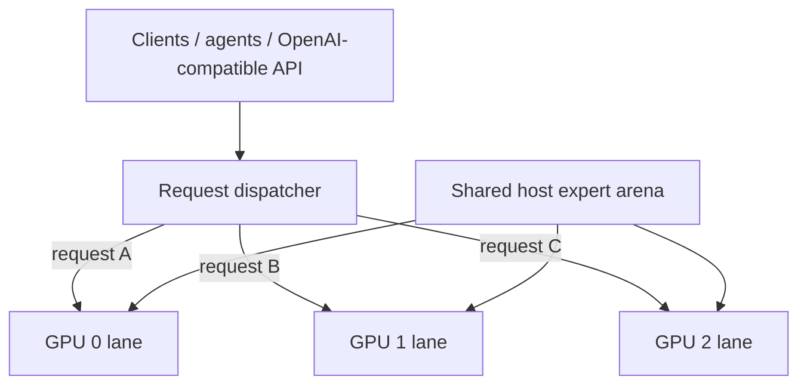

# Qwen3.8-Flash-Next / Strata GPU-per-Lane Parallel Serving Recipe

**English** | [한국어](README.ko.md) | [简体中文](README.zh-CN.md) | [日本語](README.ja.md)

A practical recipe for running **one independent Strata generation lane per GPU** while sharing one large host-RAM expert arena between lane processes.

Implementation: [`rhgo1749/Strata`](https://github.com/rhgo1749/Strata)  
**Current promoted implementation pin:** [`6cf101d`](https://github.com/rhgo1749/Strata/commit/6cf101d5b98523cbaefc34a199faa5657c5c2719)  
**Current upstream engine:** Strata **0.1.27** (`a790805`)  
**Current paper-validation model:** Qwen3.8-Flash-Next GSQ-RCO IQ3_S

## Core idea

**One request is processed by one GPU lane. Multiple requests run concurrently on different GPUs. The large expert weights in system RAM are physically shared instead of copied once per process.**



### Shared

- one physical host expert arena;
- host memory bandwidth and CPU resources;
- PCIe/root-complex bandwidth;
- runtime storage.

### Lane-local

- CUDA context and streams;
- GPU hot-expert cache and adaptive-replacement state;
- GPU-resident KV window;
- host-KV/session state;
- speculative/MTP state;
- generation/decode loop.

There is no mandatory token-by-token cross-GPU synchronization in the production path.

## Why this architecture

| Property | Practical effect |
| --- | --- |
| Slower GPUs stay isolated to their lane | A slower card does not become a mandatory token-step pace setter for faster lanes. |
| Mixed GPUs are practical | Different cards can serve independent requests. |
| Host experts are shared | The largest RAM allocation is not duplicated once per lane. |
| Failure domains stay comparatively small | Lane-local engine state is not distributed across every GPU. |
| Per-lane tuning is possible | Context, resident KV, CPU and PCIe tuning can differ by lane. |
| NVLink is not required | Normal request-per-lane decode does not depend on mandatory GPU-to-GPU transfers. |

The trade-off is explicit: **one active request normally uses one GPU lane**. This recipe targets concurrent serving and aggregate throughput rather than maximum single-request speed.

## Reference host

```text
CPU                 Ryzen 9 9950X3D, 16C/32T
RAM                 128 GB DDR5
GPU0                RTX 5070 Ti 16 GB, PCIe x8
GPU1                RTX 5070 Ti 16 GB, PCIe x4
GPU2                RTX 5070 Ti 16 GB, PCIe x8
GPU3                RTX 5060 Ti 16 GB, PCIe x4
3-lane order        GPU0 / GPU2 / GPU1 = x8 / x8 / x4
contexts            262144 / 262144 / 262144
resident KV         32768 / 32768 / 32768
physical CPU cores  5 / 6 / 5
pcie-frac           0.55 / 0.55 / 0.25 for GPU0/GPU2/GPU1 validation order
driver              NVIDIA 615.71.09
CUDA                 13.4
```

These are **reference-host values, not universal defaults**.

A useful sizing rule is:

```text
required host RAM ≈
    one shared expert arena
  + every lane's host-KV
  + OS / server / filesystem-cache headroom
```

Do **not** multiply the expert arena by GPU count; that is the allocation this fork physically shares.

## Current 0.1.27 validation

The promoted fork commit `6cf101d` passed:

- **77 serve tests, 3 skipped, 47 subtests**;
- **53 server/multi-GPU tests, 39 subtests**;
- upstream `file_expert_source_test`;
- byte parity between the fork's pinned upstream implementation and upstream 0.1.27 `pinned.cu`;
- real IQ3_S scaling, RAM-sharing, heterogeneous-isolation, workload, and mixed-serving runs.

Promotion/provenance CSV: [`bench/strata-0.1.27-promotion-20260930.csv`](bench/strata-0.1.27-promotion-20260930.csv).

## Current controlled architecture results — IQ3_S / 0.1.27

### 1 -> 2 -> 3 GPU scaling

Fixed warm workload, 512 completion tokens per active lane, five retained repetitions per point. Aggregate TG is computed from one **common wall interval**, not lane-local TG summation.

| Active lanes | Mean aggregate TG | SD | Speedup | Efficiency |
| ---: | ---: | ---: | ---: | ---: |
| 1 | **71.45 tok/s** | 1.12 | 1.000× | 100.0% |
| 2 | **137.57 tok/s** | 2.19 | **1.926×** | **96.3%** |
| 3 | **191.75 tok/s** | 7.24 | **2.684×** | **89.5%** |

### Shared host expert arena

Two-engine PSS at reduced context for a feasible private control:

| Arena mode | PSS |
| --- | ---: |
| Private arena per process | **95.298 GiB** |
| Shared arena | **52.083 GiB** |
| Saved | **43.215 GiB / 45.35%** |

The shared arm was verified through the actual `/dev/shm` mapping and PSS/`Shared_Dirty` evidence, not RSS alone.

### Heterogeneous isolation

Interleaved 8+8 trial design:

| Measurement | Mean TG | SD |
| --- | ---: | ---: |
| RTX 5070 Ti x8 solo | **73.01** | 1.41 |
| RTX 5070 Ti x8 while RTX 5060 Ti x4 is active | **72.36** | 2.26 |
| Concurrent RTX 5060 Ti x4 lane | **59.14** | 1.24 |

The nominal fast-lane difference is 0.89%, smaller than run-to-run dispersion. The supported claim is **no measurable degradation within run-to-run variance**, not a universal 0.89% slowdown.

Full systems record: [`docs/systems-ablation-0.1.27-20260930.md`](docs/systems-ablation-0.1.27-20260930.md).  
Machine-readable repetitions: [`bench/systems-ablation-0.1.27-20260930.csv`](bench/systems-ablation-0.1.27-20260930.csv).

## Real workload sensitivity — 0.1.27

Five repetitions were retained for each workload/bucket/state.

Warm steady-state decode:

| Workload | Mean TG | Cache hit | Spec acceptance |
| --- | ---: | ---: | ---: |
| Fiction short | **68.64** | 90.56% | 50.77% |
| Fiction medium | **67.98** | 89.42% | 56.28% |
| Coding short | **79.30** | 86.96% | 73.70% |
| Coding medium | **79.42** | 86.22% | 75.27% |
| Reasoning short | **76.98** | 87.78% | 72.14% |
| Reasoning medium | **68.06** | 86.50% | 63.66% |
| Long review (~110K input) | **62.98** | 84.14% | 68.73% |

No-reuse PP at ~15K input is about **2.54–2.55k tok/s** across fiction/coding/reasoning; the ~110K review averages **2554.09 tok/s PP** with **43.32 s TTFT**.

The workload results show that expert-cache hit rate alone does not determine TG: fiction has higher hit rates than coding while coding is faster. Speculative acceptance also differs materially by workload. This is observational evidence, not a causal decomposition.

All retained workload windows show **zero adaptive swap publications**, so this matrix does not establish workload-specific adaptive-replacement benefit.

Full workload analysis: [`docs/workload-sensitivity-0.1.27-20260930.md`](docs/workload-sensitivity-0.1.27-20260930.md).  
Machine-readable repetitions: [`bench/workload-sensitivity-0.1.27-20260930.csv`](bench/workload-sensitivity-0.1.27-20260930.csv).

## Mixed three-lane real-serving run

Fiction, coding, and reasoning were rotated across GPU0 x8 / GPU2 x8 / GPU1 x4. Nine common-wall runs produced **187.15 ± 5.63 tok/s**, range **176.85–196.18 tok/s**.

This is supporting multi-agent evidence rather than the controlled architecture headline.

## Upstream engine features vs fork architecture

The fork architecture contribution is the request-per-GPU lane supervisor, shared host expert backing, and associated independent-lane serving integration.

Adaptive expert replacement, QSA changes, MTP/speculative decoding, and other engine improvements belong to upstream Strata and should be attributed there. The recipe measures how those engine features behave inside the lane architecture; it does not claim to have invented them.

## Historical evidence

Historical artifacts are intentionally preserved:

- [`docs/strata-0.1.24-promotion-20260930.md`](docs/strata-0.1.24-promotion-20260930.md) — prior 0.1.24 promotion and adaptive replacement A/B;
- [`bench/adaptive-swap-20260930.csv`](bench/adaptive-swap-20260930.csv) — prior adaptive trace summary;
- [`docs/systems-ablation-20260929.md`](docs/systems-ablation-20260929.md) — earlier scaling/RAM/heterogeneous evidence;
- [`bench/systems-ablation-20260929.csv`](bench/systems-ablation-20260929.csv) — earlier machine-readable systems observations;
- [`docs/strata-0.1.22-promotion-20260929.md`](docs/strata-0.1.22-promotion-20260929.md) — historical 0.1.22 promotion.

Do not treat unmatched prompt generations as strict version A/Bs.

## Reproducibility caveat

The recovered 0.1.27 run bundle did not contain a dedicated **benchmark-start GPU clock/undervolt snapshot**. The repository has a separately documented reference tuning profile, but the 0.1.27 paper evidence does not claim that tuning state as independently verified metadata.

## How to adapt it to another PC

1. Get one normal single-GPU Strata configuration working on every GPU you intend to use.
2. Inventory VRAM, negotiated PCIe links, and relative GPU performance.
3. Confirm each GPU can fit one complete lane runtime.
4. Confirm host-RAM headroom after the shared expert arena is loaded.
5. Partition physical CPU cores so lane worker pools do not overlap.
6. Start with conservative context / resident-KV / topology values and measure each lane alone.
7. Test two lanes, then all lanes concurrently.
8. Test cold/no-reuse long prompts as well as warm short prompts.
9. Validate streaming, cancellation, tool behavior, and lane recovery before production promotion.

The measured launch example is in [`recipe/launch-3lane.sh.example`](recipe/launch-3lane.sh.example).

## Repository map

- [`RESULTS.md`](RESULTS.md) — promoted and historical reference-host results
- [`docs/systems-ablation-0.1.27-20260930.md`](docs/systems-ablation-0.1.27-20260930.md) — current systems validation
- [`docs/workload-sensitivity-0.1.27-20260930.md`](docs/workload-sensitivity-0.1.27-20260930.md) — current workload analysis
- [`bench/systems-ablation-0.1.27-20260930.csv`](bench/systems-ablation-0.1.27-20260930.csv) — current systems repetitions
- [`bench/workload-sensitivity-0.1.27-20260930.csv`](bench/workload-sensitivity-0.1.27-20260930.csv) — current workload repetitions
- [`bench/strata-0.1.27-promotion-20260930.csv`](bench/strata-0.1.27-promotion-20260930.csv) — current validation matrix
- [`bench/README.md`](bench/README.md) — benchmark/reporting contract
- [`docs/fork-and-implementation.md`](docs/fork-and-implementation.md) — fork/recipe ownership boundary

## Related projects

- Upstream Strata: [`Niko1221/Strata`](https://github.com/Niko1221/Strata)
- Multi-lane implementation fork: [`rhgo1749/Strata`](https://github.com/rhgo1749/Strata)
- ExLlamaV3 companion recipe: [`rhgo1749/qwen3.8-flash-next-exllamav3-3x5070ti-recipe`](https://github.com/rhgo1749/qwen3.8-flash-next-exllamav3-3x5070ti-recipe)

## License

Recipe documentation and helper material in this repository are MIT licensed. Strata and model files retain their own licenses.
