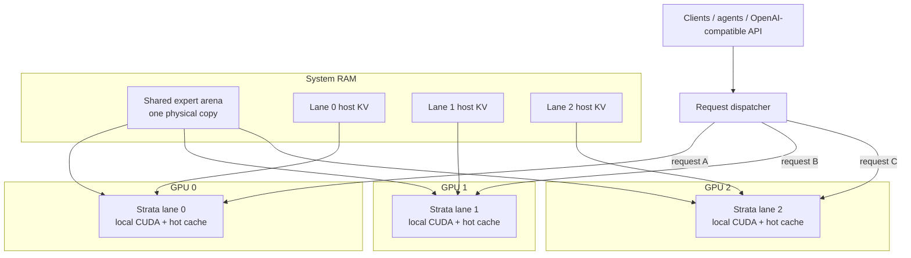

# Qwen3.8-Flash-Next / Strata GPU-per-Lane Parallel Serving Recipe

**English** | [한국어](README.ko.md) | [简体中文](README.zh-CN.md) | [日本語](README.ja.md)

A practical recipe for running **one independent Strata generation lane per GPU** while sharing one large host-RAM expert arena between lanes.

The measured reference machine uses **3 × RTX 5070 Ti 16 GB** with Qwen3.8-Flash-Next IQ3_XXS, but the architecture is not tied to three GPUs or to one GPU model. The same pattern can be adapted to more or fewer GPUs, including mixed-performance GPUs, as long as every lane can fit its own GPU-resident runtime state and the host has enough CPU, RAM, and PCIe capacity.

The same reference host has also been validated with **Qwen3.8-Flash-Next GSQ-RCO IQ3_S at 262K context on all three lanes**. IQ3_S is documented here as a **quality-oriented challenger profile** rather than a replacement for the faster IQ3_XXS production baseline.

Implementation: [`rhgo1749/Strata`](https://github.com/rhgo1749/Strata)  
Sanitized implementation pin: [`844d6206`](https://github.com/rhgo1749/Strata/commit/844d62064b4327f80eae0f2980ccbd83b04fbe9a)

## Core idea

**One request is processed by one GPU lane. Multiple requests run concurrently on different GPUs. The large expert weights in system RAM are physically shared instead of copied once per process.**

This is request/session parallelism, not tensor parallelism.



### What is shared

- the large host expert arena: one physical RAM copy;
- host memory bandwidth and CPU resources;
- PCIe/root-complex bandwidth;
- storage used by the runtime.

### What stays lane-local

- CUDA context and streams;
- GPU hot-expert cache;
- GPU-resident KV window;
- host-KV/session state;
- speculative/MTP state;
- generation request and decode loop.

There is no required token-by-token synchronization between GPUs in the production design.

## Why this architecture

| Property | Practical effect |
| --- | --- |
| Slower GPUs are isolated to their own lane | A slower card does not set every other lane's token rate. |
| Mixed GPUs are practical | Different-performance cards can serve independent requests. |
| Host expert weights are shared | Multiple processes do not need multiple physical RAM copies of the large expert arena. |
| Failure isolation is comparatively strong | One lane can fail or restart without turning every token step into a shared failure domain. |
| Per-lane tuning is possible | Context, resident KV, CPU allocation, PCIe fraction, clock and undervolt policy can differ by lane. |
| No NVLink is required | Normal decode does not depend on mandatory GPU-to-GPU transfers. |

The main trade-off is equally important: **one request normally uses one GPU lane**. If there is only one active request, the other generation lanes may be idle. This design optimizes concurrent serving and aggregate throughput rather than maximum single-request speed.

## Hardware guidance

The fork is configurable rather than tied to the reference machine. A useful sizing rule is:

> **Every selected GPU must first be able to run one usable single-GPU Strata lane. The host then needs enough RAM, CPU and PCIe capacity for all lanes concurrently.**

| Component | Practical starting point | Recommended for multi-lane use | Validated reference host |
| --- | --- | --- | --- |
| OS | Linux | Current 64-bit Linux | Ubuntu Linux |
| GPU count | 2 NVIDIA GPUs | 2–4 GPUs | 3 GPUs |
| VRAM per GPU | Enough for the selected single-GPU Strata configuration; upstream Strata starts at 12 GB for supported model sizes | **16 GB+ per GPU** for more hot-cache/KV headroom | 3 × RTX 5070 Ti 16 GB |
| System RAM | One shared expert arena + every lane's host-KV + OS/runtime headroom | Size from the actual quant/context plan; **128 GB is the validated recommendation for this 3-lane 262K ×3 IQ3_XXS recipe** | 128 GB |
| CPU | Current automatic partitioning needs at least 2 physical cores per lane | **4–6 physical cores per active lane** is a useful starting target | Ryzen 9 9950X3D 16C/32T, split 5 / 6 / 5 |
| PCIe | Stable usable link for each GPU | Prefer wider links where available; tune asymmetric lanes from measurements | Gen5 x8 / x4 / x8 |
| Storage | SSD | NVMe SSD | NVMe |
| NVLink | Not required | Not required | None |
| PSU / cooling | Must sustain the selected CPU and GPUs together | Leave normal electrical and thermal headroom for simultaneous multi-GPU load | Host-specific |

These are **guidelines, not universal minimums**. Smaller quants, fewer lanes or shorter contexts can require less RAM; more lanes, larger contexts or a larger model can require more.

The important RAM model is:

```text
required host RAM ≈
    one shared expert arena
  + lane 0 host-KV
  + lane 1 host-KV
  + ...
  + OS / server / filesystem-cache headroom
```

Do **not** multiply the expert arena by the number of GPUs: that is the part this fork physically shares.

For generic sizing and bring-up guidance, see the implementation fork's [`docs/multigpu-hardware-guide.md`](https://github.com/rhgo1749/Strata/blob/main/docs/multigpu-hardware-guide.md).

## Reference host

```text
CPU                 Ryzen 9 9950X3D, 16C/32T
RAM                 128 GB DDR5
GPUs                RTX 5070 Ti 16 GB ×3
PCIe                Gen5 x8 / x4 / x8
model               Qwen3.8-Flash-Next IQ3_XXS
contexts            262144 / 262144 / 262144
host-KV guard       786432
resident KV         32768 / 32768 / 32768
CPU cores           5 / 6 / 5
pcie-frac           0.55 / 0.25 / 0.55
shared expert arena ~39.97 GiB
GPU V/F plateau     2300 MHz @ >=875 mV
VRAM offset         +2500
```

These are **reference-host values, not universal defaults**.

## Canonical performance measurements

The **second-undervolt state above is the canonical public performance state** for this recipe. Earlier pre-second-undervolt throughput figures are intentionally not promoted here.

- warm lane-local TG: **78.8 / 78.4 / 80.1 tok/s**;
- lane-sum TG: **237.3 tok/s**;
- no-reuse PP spot checks: **1,529.7 / 1,421.6 / 1,536.9 tok/s**;
- mean no-reuse PP across those independent lane observations: about **1,496 tok/s/lane**;
- three concurrent full-window requests of roughly **141K–145K tokens each** completed without context overflow, CUDA OOM, or lane death.

> **237.3 tok/s is a lane-sum of engine-reported TG, not a clean wall-clock aggregate.**

The three PP observations were also independent spot checks rather than one synchronized prefill interval, so they should not be summed into an aggregate PP claim.

The 141K–145K ×3 run is retained as **262K ×3 capacity and client-compatibility evidence**, not as the canonical throughput benchmark.

See [`RESULTS.md`](RESULTS.md) and [`docs/undervolt-v2-20260929.md`](docs/undervolt-v2-20260929.md) for the full dataset and reporting rules.

## IQ3_S quality-oriented challenger

A clean three-lane run also validated **Qwen3.8-Flash-Next GSQ-RCO IQ3_S** on the same 3 × 16 GB GPU / 128 GB host with **262144 context configured on every lane**.

| Measurement | IQ3_S result |
| --- | ---: |
| Shared host expert arena | **46.84 GiB** |
| Hot-expert cache per GPU | **4548 slots / 8.67 GiB** |
| Warm short-decode TG | **60.5 / 63.8 / 59.1 tok/s** |
| Engine-reported TG lane-sum | **183.4 tok/s** |
| Concurrent ~30K no-reuse PP | **1,553.7 / 1,323.9 / 1,545.1 tok/s** |
| x8-lane mean ~30K PP | **~1,549 tok/s** |

The larger IQ3_S quant increased the shared expert arena from roughly **39.97 GiB to 46.84 GiB (~17%)**. The middle PCIe Gen5 x4 lane reached **1,323.9 tok/s** in the ~30K no-reuse prefill run, about **14.6% below** the mean of the two x8 lanes, making the asymmetric PCIe topology more visible with this profile.

Compared with the canonical IQ3_XXS short-probe lane-sum of 237.3 tok/s, the separate IQ3_S run's 183.4 tok/s suggests an **indicative ~23% decode penalty**. This is **not a controlled quantization A/B**: the measurements were taken from different short-probe datasets and must not be presented as a same-prompt, same-generation-length delta.

IQ3_S is therefore kept as the **higher-quality challenger profile** while IQ3_XXS remains the canonical performance profile. A controlled same-prompt quality/performance A/B is still needed before promoting IQ3_S for the intended agent workload.

Full IQ3_S setup, measurement hygiene, per-lane results and power samples: [`docs/iq3-s-3lane-benchmark-20260929.md`](docs/iq3-s-3lane-benchmark-20260929.md).

## How to adapt it to another PC

Do not copy the reference machine's `5/6/5` CPU split or `0.55/0.25/0.55` PCIe fractions blindly.

1. Get one normal single-GPU Strata configuration working first on every GPU you intend to use.
2. Inventory each GPU's VRAM, negotiated PCIe link, and expected relative performance.
3. Make sure every selected GPU can fit one complete lane runtime.
4. Confirm system-RAM headroom after the shared expert arena is loaded.
5. Partition physical CPU cores so lane worker pools do not overlap.
6. Start with conservative context / resident-KV / topology settings and measure each lane alone.
7. Test two lanes, then all lanes concurrently.
8. Test cold long prompts as well as warm short prompts.
9. Validate streaming, tool calls, cancellation, and lane recovery before treating a configuration as production-ready.

The measured three-lane launch example is in [`recipe/launch-3lane.sh.example`](recipe/launch-3lane.sh.example).

## Implementation relationship

The upstream engine stays responsible for the normal single-GPU numerical path. The implementation fork adds the shared arena, multi-lane supervisor, request-level routing, serving hardening, tests, and generic architecture contracts. This recipe repository owns **hardware-specific tuning and benchmark evidence**.

See [`docs/fork-and-implementation.md`](docs/fork-and-implementation.md) for the exact relationship.

## Current non-goals

The production path does not require:

- tensor parallelism;
- pipeline parallelism;
- mandatory cross-GPU expert ownership;
- GPU-to-GPU KV migration;
- a dynamic shared KV allocator;
- single-process multi-GPU decode.

Those remain architecture challengers rather than assumed upgrades. The implementation roadmap is maintained in [`rhgo1749/Strata`](https://github.com/rhgo1749/Strata/blob/main/docs/multigpu-roadmap.md).

## Repository map

- [`RESULTS.md`](RESULTS.md) — reference-host results and reporting rules
- [`docs/undervolt-v2-20260929.md`](docs/undervolt-v2-20260929.md) — canonical second-undervolt GPU tuning and PP/TG dataset
- [`docs/iq3-s-3lane-benchmark-20260929.md`](docs/iq3-s-3lane-benchmark-20260929.md) — IQ3_S three-lane challenger benchmark, PP/TG and power samples
- [`docs/reference-host-validation-20260929.md`](docs/reference-host-validation-20260929.md) — sanitized full-window serving validation
- [`docs/fork-and-implementation.md`](docs/fork-and-implementation.md) — fork/recipe ownership boundary
- [`bench/README.md`](bench/README.md) — benchmark/reporting rules
- [`recipe/launch-3lane.sh.example`](recipe/launch-3lane.sh.example) — measured launch example

## Related projects

- Upstream Strata: [`Niko1221/Strata`](https://github.com/Niko1221/Strata)
- Multi-lane implementation fork: [`rhgo1749/Strata`](https://github.com/rhgo1749/Strata)
- ExLlamaV3 companion recipe: [`rhgo1749/qwen3.8-flash-next-exllamav3-3x5070ti-recipe`](https://github.com/rhgo1749/qwen3.8-flash-next-exllamav3-3x5070ti-recipe)

## License

Recipe documentation and helper material in this repository are MIT licensed. Strata and model files retain their own licenses.
