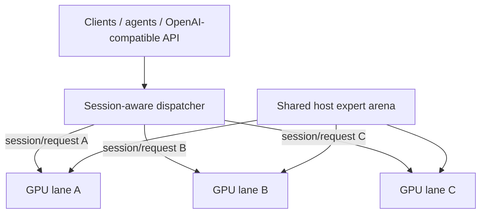

# Qwen3.8-Flash-Next / Strata GPU-per-Lane 并行服务方案

[English](README.md) | [한국어](README.ko.md) | **简体中文** | [日本語](README.ja.md)

本仓库记录一种实用的多 GPU 服务结构：**每张 GPU 运行一个独立 Strata generation lane**，多个 lane 进程只在主机内存中**物理共享一份大型 expert arena**。

**Upstream：** Strata 是由 [Niko1221](https://github.com/Niko1221) 创建并维护的推理引擎，上游仓库为 [`Niko1221/Strata`](https://github.com/Niko1221/Strata)。本仓库记录构建在该引擎之上的 multi-lane serving 与 shared-arena 扩展。

## 当前状态

- 实现 fork：[`rhgo1749/Strata-Lanes`](https://github.com/rhgo1749/Strata-Lanes)
- **当前运行用 Strata pin：** [`d7afade`](https://github.com/rhgo1749/Strata-Lanes/commit/d7afade41f06d4486a4feb2dd59b2864122e0e2e)
- 引擎基线：Strata **0.1.31**（upstream `9259cad`）；升级记录：[`docs/strata-0.1.31-promotion-20261001.md`](docs/strata-0.1.31-promotion-20261001.md)
- 参考主机当前 production quant：**Qwen3.8-Flash-Next GSQ-RCO IQ3_S**
`main` 跟踪当前运行方案。保留的实测结果与版本边界记录在 [`RESULTS.md`](RESULTS.md)。更早的快照不再重复保留在滚动 `main` 中，可通过 Git history 与命名分支查看。

## 核心结构

**一个活动请求由一个 GPU lane 处理；多个请求可在不同 GPU 上并行运行。大型 expert 权重在系统 RAM 中物理共享，而不是每个进程各复制一份。**



CUDA 状态、GPU hot-expert cache、GPU-resident KV、host-KV/session 状态、speculative/MTP 状态以及 generation loop 都保持 lane-local。正常 production 路径不需要强制 token-by-token 跨 GPU 同步，也不依赖 NVLink。

## Session-aware 调度器

最初的 multi-lane supervisor 使用 request-level free-lane/round-robin。对独立吞吐测试这没问题，但 KV/prompt cache 是 lane-local 的，因此长对话后续轮次如果被送到另一张 GPU，就可能重新支付完整或大规模 prompt prefill。

当前 `main` 使用 **严格 session affinity + balanced-additive 新 session 放置**，优先级明确如下：

1. 先只保留健康、且满足硬能力条件（例如 vision）的 lane。
2. 如果请求属于已知 session，则使用该 session 记住的 lane。若该 lane busy，**等待该 lane，而不是 spill 到其他 GPU。**
3. 完全新的 session 不会插入 busy lane。若所有候选 lane 都 busy，则等到某个 request/stream 完全结束并 release lane。
4. 在可用的 idle lane 中，先选择 **已记忆 affinity session 数最少的 lane**，避免长期 cache state 把某个 lane 变成永久吸引点。
5. affinity session 数相同的候选中，最小化 **估计 new-prefill bytes + 最近一次已完成请求的 retained bytes**。这只是 routing-state proxy，不代表 engine-truth compute cost。
6. live-state recency 与 rotating candidate order 仍用于最终平局处理。`safe-affinity-live-state-v1` 保留为明确的 rollback 策略。

排队的新 session 使用 **compatible FIFO ticket**：更早等待且可使用该 lane 的请求优先获得刚释放的 lane，而 vision 之类有 capability 约束的请求不会阻塞自己不能使用的其他 lane。已知 session 的 continuation 在等待自己的 lane 时会对该 lane 做 reservation，因此 `notify_all()` 的唤醒竞争不会让新 session 抢走 cache-rich lane。真正的空 live state 由 `live_request_bytes == 0` 判断，而不是看是否存在 affinity key。

此策略**不硬编码 GPU 编号、GPU 型号或 PCIe 宽度**。`busy` 的生命周期是 request/stream 级，affinity 的生命周期是 session 级。同一个 engine 可以记住多个 session key，因此即使中间有别的请求使用该 engine，旧 session 仍可回到同一 engine，并重新利用 Strata 的 per-engine prompt-cache checkpoint。

production smoke 已验证 A → B → C → D → A：A/B/C 分别占用空 lane，D 选择 live state 最小的 lane，最后 A 仍回到原来的 lane。另一次 overload smoke 在 3 个 lane 都忙时再加入 4 个请求，观测到 `peak_queue_depth=4`；7 个请求全部成功后恢复到 `queue_depth=0`，所有 lane 均 idle。

该调度器属于**当前 lane-local KV 架构的 serving hardening**，并不宣称是最终最优方案。cache-aware global scheduling、migration/transfer cost、overload queueing 以及更完整的 cost model 仍属于 roadmap 工作。

## 参考主机

```text
CPU                 Ryzen 9 9950X3D, 16C/32T
RAM                 128 GB DDR5
GPU lanes           RTX 5070 Ti 16 GB ×3
PCIe                x8 / x4 / x8
contexts            262144 / 262144 / 262144
resident KV         32768 / 32768 / 32768
VRAM reserve MiB    1200 / 1200 / 1200
physical CPU cores  5 / 6 / 5
production vision   1 个选定 lane
current quant       IQ3_S
```

这些是**参考主机的实测值，不是通用默认值**。

### mixed vision/text lane 的 VRAM reserve 注意事项

从启用了 vision 的基础配置派生 text-only lane 时，可以移除 `--vision` 和 encoder 配置，但不能让 VRAM 安全余量也一起消失。在参考 RTX 5070 Ti 16 GB / IQ3_S / 262K context / resident-KV 32768 环境中，non-vision lane 回退到 700 MiB reserve 后，模型加载完成时只剩约 **93 MiB** 可用 VRAM，并实际触发了 `verify: instantiate: out of memory`。

当前 production 明确设置 `--lane-vram-reserve-mibs 1200,1200,1200`。重新测量后 GPU0/GPU1/GPU2 分别剩余 **593 / 592 / 593 MiB** VRAM；三个 lane 的并发 public 请求全部返回 HTTP 200，新一轮启动后没有出现新的 OOM、illegal-memory 或 engine-stop。1200 MiB 仍然只是**参考主机的安全值**，不是所有 GPU 的通用默认值。这个问题是 mixed-capability lane 派生时 text-only lane 丢失 reserve 所暴露出来的，并不是 vision encoder 占用了 text-only GPU 的 VRAM。

主机内存可用下面的近似规则估算：

```text
required host RAM ≈ one shared expert arena + every lane's host-KV + OS/runtime headroom
```

## 版本化证据

滚动 `main` 只保留当前 **0.1.31 运行基线**与紧邻的 **0.1.30 benchmark generation**。测量结果保留原始引擎版本，不把旧版本结果重新标记为当前结果。

参见：

- [`RESULTS.md`](RESULTS.md) — 当前摘要与保留的 benchmark evidence
- [`docs/strata-0.1.31-promotion-20261001.md`](docs/strata-0.1.31-promotion-20261001.md) — 当前运行 parity 升级记录
- [`docs/strata-0.1.30-promotion-20261001.md`](docs/strata-0.1.30-promotion-20261001.md) — 保留的完整 benchmark generation
- [`docs/fork-and-implementation.md`](docs/fork-and-implementation.md) — upstream/fork/recipe 角色边界

## 在其他机器上应用

1. 先让每张目标 GPU 都能独立运行正常的 single-GPU Strata。
2. 检查 VRAM、实际协商的 PCIe link、RAM 余量和 CPU topology。
3. 划分 physical CPU core，避免不同 lane 的 worker pool 重叠。
4. 从保守的 context/resident-KV 值开始，先逐 lane 验证。
5. 验证多 lane 并发、cold/no-reuse 长 prompt、streaming/cancellation、lane recovery，以及 **multi-turn session affinity**。
6. 将参考主机的 tuning 值视为测量结果，而不是可直接复制的默认值。

## 相关项目

- Upstream Strata: [`Niko1221/Strata`](https://github.com/Niko1221/Strata)
- Multi-lane 实现 fork: [`rhgo1749/Strata-Lanes`](https://github.com/rhgo1749/Strata-Lanes)
- ExLlamaV3 companion recipe: [`rhgo1749/qwen3.8-flash-next-exllamav3-3x5070ti-recipe`](https://github.com/rhgo1749/qwen3.8-flash-next-exllamav3-3x5070ti-recipe)

## License

本仓库的 recipe 文档和辅助材料采用 MIT License。Strata 与模型文件继续遵循各自原有许可证。